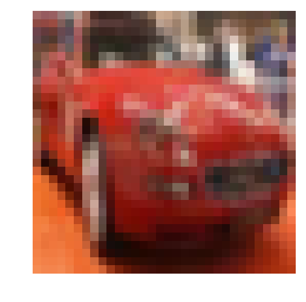
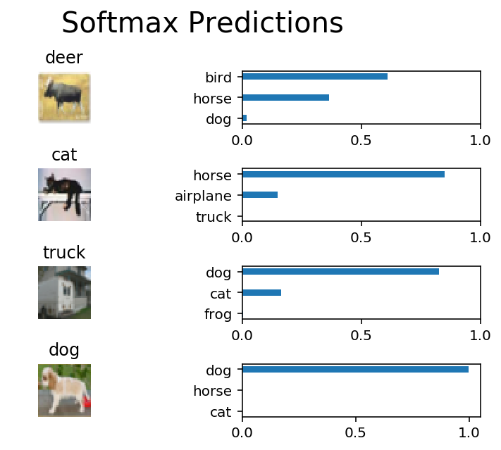

# 图像分类

在此项目中，你将对 [CIFAR-10 数据集](https://www.cs.toronto.edu/~kriz/cifar.html) 中的图片进行分类。该数据集包含飞机、猫狗和其他物体。你需要预处理这些图片，然后用所有样本训练一个卷积神经网络。图片需要标准化（normalized），标签需要采用 one-hot 编码。你需要应用所学的知识构建卷积的、最大池化（max pooling）、丢弃（dropout）和完全连接（fully connected）的层。最后，你需要在样本图片上看到神经网络的预测结果。


## 获取数据

请运行以下单元，以下载 [CIFAR-10 数据集（Python版）](https://www.cs.toronto.edu/~kriz/cifar-10-python.tar.gz)。


```python
"""
DON'T MODIFY ANYTHING IN THIS CELL THAT IS BELOW THIS LINE
"""
from urllib.request import urlretrieve
from os.path import isfile, isdir
from tqdm import tqdm
import problem_unittests as tests
import tarfile

cifar10_dataset_folder_path = 'cifar-10-batches-py'

# Use Floyd's cifar-10 dataset if present
floyd_cifar10_location = '/input/cifar-10/python.tar.gz'
if isfile(floyd_cifar10_location):
    tar_gz_path = floyd_cifar10_location
else:
    tar_gz_path = 'cifar-10-python.tar.gz'

class DLProgress(tqdm):
    last_block = 0

    def hook(self, block_num=1, block_size=1, total_size=None):
        self.total = total_size
        self.update((block_num - self.last_block) * block_size)
        self.last_block = block_num

if not isfile(tar_gz_path):
    with DLProgress(unit='B', unit_scale=True, miniters=1, desc='CIFAR-10 Dataset') as pbar:
        urlretrieve(
            'https://www.cs.toronto.edu/~kriz/cifar-10-python.tar.gz',
            tar_gz_path,
            pbar.hook)

if not isdir(cifar10_dataset_folder_path):
    with tarfile.open(tar_gz_path) as tar:
        tar.extractall()
        tar.close()


tests.test_folder_path(cifar10_dataset_folder_path)
```

    /home/haoran/anaconda3/lib/python3.6/importlib/_bootstrap.py:219: RuntimeWarning: compiletime version 3.5 of module 'tensorflow.python.framework.fast_tensor_util' does not match runtime version 3.6
      return f(*args, **kwds)
    /home/haoran/anaconda3/lib/python3.6/site-packages/h5py/__init__.py:36: FutureWarning: Conversion of the second argument of issubdtype from `float` to `np.floating` is deprecated. In future, it will be treated as `np.float64 == np.dtype(float).type`.
      from ._conv import register_converters as _register_converters


    All files found!


## 探索数据

该数据集分成了几部分／批次（batches），以免你的机器在计算时内存不足。CIFAR-10 数据集包含 5 个部分，名称分别为 `data_batch_1`、`data_batch_2`，以此类推。每个部分都包含以下某个类别的标签和图片：

* 飞机
* 汽车
* 鸟类
* 猫
* 鹿
* 狗
* 青蛙
* 马
* 船只
* 卡车

了解数据集也是对数据进行预测的必经步骤。你可以通过更改 `batch_id` 和 `sample_id` 探索下面的代码单元。`batch_id` 是数据集一个部分的 ID（1 到 5）。`sample_id` 是该部分中图片和标签对（label pair）的 ID。

问问你自己：“可能的标签有哪些？”、“图片数据的值范围是多少？”、“标签是按顺序排列，还是随机排列的？”。思考类似的问题，有助于你预处理数据，并使预测结果更准确。


```python
%matplotlib inline
%config InlineBackend.figure_format = 'retina'

import helper
import numpy as np

# Explore the dataset
batch_id = 1
sample_id = 5
helper.display_stats(cifar10_dataset_folder_path, batch_id, sample_id)
```

    
    Stats of batch 1:
    Samples: 10000
    Label Counts: {0: 1005, 1: 974, 2: 1032, 3: 1016, 4: 999, 5: 937, 6: 1030, 7: 1001, 8: 1025, 9: 981}
    First 20 Labels: [6, 9, 9, 4, 1, 1, 2, 7, 8, 3, 4, 7, 7, 2, 9, 9, 9, 3, 2, 6]
    
    Example of Image 5:
    Image - Min Value: 0 Max Value: 252
    Image - Shape: (32, 32, 3)
    Label - Label Id: 1 Name: automobile





## 实现预处理函数

### 标准化

在下面的单元中，实现 `normalize` 函数，传入图片数据 `x`，并返回标准化 Numpy 数组。值应该在 0 到 1 的范围内（含 0 和 1）。返回对象应该和 `x` 的形状一样。


```python
def normalize(x):
    """
    Normalize a list of sample image data in the range of 0 to 1
    : x: List of image data.  The image shape is (32, 32, 3)
    : return: Numpy array of normalize data
    """
    arrayMax = np.max(x)
    arrayMin = np.min(x)
    Xnormalize = (x - arrayMin) / (arrayMax - arrayMin)
    # TODO: Implement Function
    return Xnormalize


"""
DON'T MODIFY ANYTHING IN THIS CELL THAT IS BELOW THIS LINE
"""
tests.test_normalize(normalize)
```

    Tests Passed


### One-hot 编码

和之前的代码单元一样，你将为预处理实现一个函数。这次，你将实现 `one_hot_encode` 函数。输入，也就是 `x`，是一个标签列表。实现该函数，以返回为 one_hot 编码的 Numpy 数组的标签列表。标签的可能值为 0 到 9。每次调用 `one_hot_encode` 时，对于每个值，one_hot 编码函数应该返回相同的编码。确保将编码映射保存到该函数外面。

提示：不要重复发明轮子。


```python
from sklearn import preprocessing
def one_hot_encode(x):
    """
    One hot encode a list of sample labels. Return a one-hot encoded vector for each label.
    : x: List of sample Labels
    : return: Numpy array of one-hot encoded labels
    """
    # TODO: Implement Function
    enc = preprocessing.LabelBinarizer()
    enc.fit([0,1,2,3,4,5,6,7,8,9])
    ohe = enc.transform(x)
    return ohe


"""
DON'T MODIFY ANYTHING IN THIS CELL THAT IS BELOW THIS LINE
"""
tests.test_one_hot_encode(one_hot_encode)
```

    Tests Passed


### 随机化数据

之前探索数据时，你已经了解到，样本的顺序是随机的。再随机化一次也不会有什么关系，但是对于这个数据集没有必要。


## 预处理所有数据并保存

运行下方的代码单元，将预处理所有 CIFAR-10 数据，并保存到文件中。下面的代码还使用了 10% 的训练数据，用来验证。


```python
"""
DON'T MODIFY ANYTHING IN THIS CELL
"""
# Preprocess Training, Validation, and Testing Data
helper.preprocess_and_save_data(cifar10_dataset_folder_path, normalize, one_hot_encode)
```

# 检查点

这是你的第一个检查点。如果你什么时候决定再回到该记事本，或需要重新启动该记事本，你可以从这里开始。预处理的数据已保存到本地。


```python
"""
DON'T MODIFY ANYTHING IN THIS CELL
"""
import pickle
import problem_unittests as tests
import helper

# Load the Preprocessed Validation data
valid_features, valid_labels = pickle.load(open('preprocess_validation.p', mode='rb'))
```

    /home/haoran/anaconda3/lib/python3.6/importlib/_bootstrap.py:219: RuntimeWarning: compiletime version 3.5 of module 'tensorflow.python.framework.fast_tensor_util' does not match runtime version 3.6
      return f(*args, **kwds)
    /home/haoran/anaconda3/lib/python3.6/site-packages/h5py/__init__.py:36: FutureWarning: Conversion of the second argument of issubdtype from `float` to `np.floating` is deprecated. In future, it will be treated as `np.float64 == np.dtype(float).type`.
      from ._conv import register_converters as _register_converters


## 构建网络

对于该神经网络，你需要将每层都构建为一个函数。你看到的大部分代码都位于函数外面。要更全面地测试你的代码，我们需要你将每层放入一个函数中。这样使我们能够提供更好的反馈，并使用我们的统一测试检测简单的错误，然后再提交项目。

>**注意**：如果你觉得每周很难抽出足够的时间学习这门课程，我们为此项目提供了一个小捷径。对于接下来的几个问题，你可以使用 [TensorFlow Layers](https://www.tensorflow.org/api_docs/python/tf/layers) 或 [TensorFlow Layers (contrib)](https://www.tensorflow.org/api_guides/python/contrib.layers) 程序包中的类来构建每个层级，但是“卷积和最大池化层级”部分的层级除外。TF Layers 和 Keras 及 TFLearn 层级类似，因此很容易学会。

>但是，如果你想充分利用这门课程，请尝试自己解决所有问题，不使用 TF Layers 程序包中的任何类。你依然可以使用其他程序包中的类，这些类和你在 TF Layers 中的类名称是一样的！例如，你可以使用 TF Neural Network 版本的 `conv2d` 类 [tf.nn.conv2d](https://www.tensorflow.org/api_docs/python/tf/nn/conv2d)，而不是 TF Layers 版本的 `conv2d` 类 [tf.layers.conv2d](https://www.tensorflow.org/api_docs/python/tf/layers/conv2d)。

我们开始吧！


### 输入

神经网络需要读取图片数据、one-hot 编码标签和丢弃保留概率（dropout keep probability）。请实现以下函数：

* 实现 `neural_net_image_input`
 * 返回 [TF Placeholder](https://www.tensorflow.org/api_docs/python/tf/placeholder)
 * 使用 `image_shape` 设置形状，部分大小设为 `None`
 * 使用 [TF Placeholder](https://www.tensorflow.org/api_docs/python/tf/placeholder) 中的 TensorFlow `name` 参数对 TensorFlow 占位符 "x" 命名
* 实现 `neural_net_label_input`
 * 返回 [TF Placeholder](https://www.tensorflow.org/api_docs/python/tf/placeholder)
 * 使用 `n_classes` 设置形状，部分大小设为 `None`
 * 使用 [TF Placeholder](https://www.tensorflow.org/api_docs/python/tf/placeholder) 中的 TensorFlow `name` 参数对 TensorFlow 占位符 "y" 命名
* 实现 `neural_net_keep_prob_input`
 * 返回 [TF Placeholder](https://www.tensorflow.org/api_docs/python/tf/placeholder)，用于丢弃保留概率
 * 使用 [TF Placeholder](https://www.tensorflow.org/api_docs/python/tf/placeholder) 中的 TensorFlow `name` 参数对 TensorFlow 占位符 "keep_prob" 命名

这些名称将在项目结束时，用于加载保存的模型。

注意：TensorFlow 中的 `None` 表示形状可以是动态大小。


```python
import tensorflow as tf

def neural_net_image_input(image_shape):
    """
    Return a Tensor for a batch of image input
    : image_shape: Shape of the images
    : return: Tensor for image input.
    """
    
    # TODO: Implement Function
    #要给节点输入数据时用 placeholder，在 TensorFlow 中用placeholder 来描述等待输入的节点，只需要指定类型即可，
    #然后在执行节点的时候用一个字典来“喂”这些节点。相当于先把变量 hold 住，然后每次从外部传入data，
    #注意 placeholder 和 feed_dict 是绑定用的。
    #这里简单提一下 feed 机制， 给 feed 提供数据，作为 run()
    #调用的参数， feed 只在调用它的方法内有效, 方法结束, feed 就会消失。
    #要结合着计算图，可以看做是节点
    #placeholder是TensorFlow的占位符节点，由placeholder方法创建，其也是一种常量，
    #但是由用户在调用run方法是传递的，也可以将placeholder理解为一种形参。即其不像constant那样直接可以使用，需要用户传递常数值。
    # x = tf.placeholder(tf.float32, shape = [None, image_shape[0], image_shape[1], image_shape[2]])
    
    
    return tf.placeholder(tf.float32, shape = [None, image_shape[0], image_shape[1], image_shape[2]],name = 'x')


def neural_net_label_input(n_classes):
    """
    Return a Tensor for a batch of label input
    : n_classes: Number of classes
    : return: Tensor for label input.
    """
    # TODO: Implement Function
    #y = tf.placeholder(tf.float32, shape = [None, n_classes])
    
    
    return tf.placeholder(tf.float32, shape = [None, n_classes], name='y')


def neural_net_keep_prob_input():
    """
    Return a Tensor for keep probability
    : return: Tensor for keep probability.
    """
    # TODO: Implement Function
    #KeepProb = tf.placeholder(tf.float32, name='keep_prob')
    
    
    return tf.placeholder(tf.float32, name='keep_prob')


"""
DON'T MODIFY ANYTHING IN THIS CELL THAT IS BELOW THIS LINE
"""
tf.reset_default_graph()
tests.test_nn_image_inputs(neural_net_image_input)
tests.test_nn_label_inputs(neural_net_label_input)
tests.test_nn_keep_prob_inputs(neural_net_keep_prob_input)
```

    Image Input Tests Passed.
    Label Input Tests Passed.
    Keep Prob Tests Passed.


### 卷积和最大池化层

卷积层级适合处理图片。对于此代码单元，你应该实现函数 `conv2d_maxpool` 以便应用卷积然后进行最大池化：

* 使用 `conv_ksize`、`conv_num_outputs` 和 `x_tensor` 的形状创建权重（weight）和偏置（bias）。
* 使用权重和 `conv_strides` 对 `x_tensor` 应用卷积。
 * 建议使用我们建议的间距（padding），当然也可以使用任何其他间距。
* 添加偏置
* 向卷积中添加非线性激活（nonlinear activation）
* 使用 `pool_ksize` 和 `pool_strides` 应用最大池化
 * 建议使用我们建议的间距（padding），当然也可以使用任何其他间距。

**注意**：对于**此层**，**请勿使用** [TensorFlow Layers](https://www.tensorflow.org/api_docs/python/tf/layers) 或 [TensorFlow Layers (contrib)](https://www.tensorflow.org/api_guides/python/contrib.layers)，但是仍然可以使用 TensorFlow 的 [Neural Network](https://www.tensorflow.org/api_docs/python/tf/nn) 包。对于所有**其他层**，你依然可以使用快捷方法。


```python
def conv2d_maxpool(x_tensor, conv_num_outputs, conv_ksize, conv_strides, pool_ksize, pool_strides):
    """
    Apply convolution then max pooling to x_tensor
    :param x_tensor: TensorFlow Tensor
    :param conv_num_outputs: Number of outputs for the convolutional layer
    :param conv_ksize: kernal size 2-D Tuple for the convolutional layer
    :param conv_strides: Stride 2-D Tuple for convolution
    :param pool_ksize: kernal size 2-D Tuple for pool
    :param pool_strides: Stride 2-D Tuple for pool
    : return: A tensor that represents convolution and max pooling of x_tensor
    """
    
    # TODO: Implement Function
    weight = tf.Variable(tf.truncated_normal([conv_ksize[0], conv_ksize[1], x_tensor.shape[3].value, conv_num_outputs], stddev=0.1))
    # https://stackoverflow.com/questions/41704484/what-is-difference-between-tf-truncated-normal-and-tf-random-normal/41704789
    # TOO BIG WEIGHTS can't leed network to restrain
    # https://www.cnblogs.com/makefile/p/init-weight.html?utm_source=itdadao&utm_medium=referral
    # https://blog.csdn.net/dugudaibo/article/details/77318847
    # http://www.sohu.com/a/135067464_714863
    stride = [1, conv_strides[0], conv_strides[1], 1]
    bias = tf.Variable(tf.zeros(conv_num_outputs))
    y = tf.nn.conv2d(input=x_tensor, filter=weight, strides=stride, padding='SAME')
    # tf.nn.conv2d ： https://blog.csdn.net/mao_xiao_feng/article/details/53444333
    y = tf.nn.bias_add(y, bias)
    y = tf.nn.relu(y)
    
    weightspool = [1, pool_ksize[0], pool_ksize[1], 1]
    stridespool = [1, pool_strides[0], pool_strides[1], 1]
    y = tf.nn.max_pool(y, ksize=weightspool, strides=stridespool, padding='SAME')
    #tf.nn.max_pool ：https://blog.csdn.net/mao_xiao_feng/article/details/53453926
    return y


"""
DON'T MODIFY ANYTHING IN THIS CELL THAT IS BELOW THIS LINE
"""
tests.test_con_pool(conv2d_maxpool)
```

    Tests Passed


### 扁平化层

实现 `flatten` 函数，将 `x_tensor` 的维度从四维张量（4-D tensor）变成二维张量。输出应该是形状（*部分大小（Batch Size）*，*扁平化图片大小（Flattened Image Size）*）。快捷方法：对于此层，你可以使用 [TensorFlow Layers](https://www.tensorflow.org/api_docs/python/tf/layers) 或 [TensorFlow Layers (contrib)](https://www.tensorflow.org/api_guides/python/contrib.layers) 包中的类。如果你想要更大挑战，可以仅使用其他 TensorFlow 程序包。


```python
def flatten(x_tensor):
    """
    Flatten x_tensor to (Batch Size, Flattened Image Size)
    : x_tensor: A tensor of size (Batch Size, ...), where ... are the image dimensions.
    : return: A tensor of size (Batch Size, Flattened Image Size).
    """
    # TODO: Implement Function
    return tf.contrib.layers.flatten(x_tensor)


"""
DON'T MODIFY ANYTHING IN THIS CELL THAT IS BELOW THIS LINE
"""
tests.test_flatten(flatten)
```

    Tests Passed


### 全连接层

实现 `fully_conn` 函数，以向 `x_tensor` 应用完全连接的层级，形状为（*部分大小（Batch Size）*，*num_outputs*）。快捷方法：对于此层，你可以使用 [TensorFlow Layers](https://www.tensorflow.org/api_docs/python/tf/layers) 或 [TensorFlow Layers (contrib)](https://www.tensorflow.org/api_guides/python/contrib.layers) 包中的类。如果你想要更大挑战，可以仅使用其他 TensorFlow 程序包。


```python
def fully_conn(x_tensor, num_outputs):
    """
    Apply a fully connected layer to x_tensor using weight and bias
    : x_tensor: A 2-D tensor where the first dimension is batch size.
    : num_outputs: The number of output that the new tensor should be.
    : return: A 2-D tensor where the second dimension is num_outputs.
    """
    # TODO: Implement Function
    return tf.contrib.layers.fully_connected(x_tensor, num_outputs, activation_fn=tf.nn.relu)


"""
DON'T MODIFY ANYTHING IN THIS CELL THAT IS BELOW THIS LINE
"""
tests.test_fully_conn(fully_conn)
```

    Tests Passed


### 输出层

实现 `output` 函数，向 x_tensor 应用完全连接的层级，形状为（*部分大小（Batch Size）*，*num_outputs*）。快捷方法：对于此层，你可以使用 [TensorFlow Layers](https://www.tensorflow.org/api_docs/python/tf/layers) 或 [TensorFlow Layers (contrib)](https://www.tensorflow.org/api_guides/python/contrib.layers) 包中的类。如果你想要更大挑战，可以仅使用其他 TensorFlow 程序包。

**注意**：该层级不应应用 Activation、softmax 或交叉熵（cross entropy）。


```python
def output(x_tensor, num_outputs):
    """
    Apply a output layer to x_tensor using weight and bias
    : x_tensor: A 2-D tensor where the first dimension is batch size.
    : num_outputs: The number of output that the new tensor should be.
    : return: A 2-D tensor where the second dimension is num_outputs.
    """
    # TODO: Implement Function
    return tf.contrib.layers.fully_connected(x_tensor, num_outputs, activation_fn=None)


"""
DON'T MODIFY ANYTHING IN THIS CELL THAT IS BELOW THIS LINE
"""
tests.test_output(output)
```

    Tests Passed


### 创建卷积模型

实现函数 `conv_net`， 创建卷积神经网络模型。该函数传入一批图片 `x`，并输出对数（logits）。使用你在上方创建的层创建此模型：

* 应用 1、2 或 3 个卷积和最大池化层（Convolution and Max Pool layers）
* 应用一个扁平层（Flatten Layer）
* 应用 1、2 或 3 个完全连接层（Fully Connected Layers）
* 应用一个输出层（Output Layer）
* 返回输出
* 使用 `keep_prob` 向模型中的一个或多个层应用 [TensorFlow 的 Dropout](https://www.tensorflow.org/api_docs/python/tf/nn/dropout)


```python
def conv_net(x, keep_prob):
    """
    Create a convolutional neural network model
    : x: Placeholder tensor that holds image data.
    : keep_prob: Placeholder tensor that hold dropout keep probability.
    : return: Tensor that represents logits
    """
    # TODO: Apply 1, 2, or 3 Convolution and Max Pool layers
    #    Play around with different number of outputs, kernel size and stride
    # Function Definition from Above:
    #    conv2d_maxpool(x_tensor, conv_num_outputs, conv_ksize, conv_strides, pool_ksize, pool_strides)
    
    x_cm = conv2d_maxpool(x, 64, [3, 3], [1, 1], [2, 2], [1, 1])
    x_cm = conv2d_maxpool(x_cm, 64, [3, 3], [1, 1], [2, 2], [1, 1])
    x_cm = conv2d_maxpool(x_cm, 64, [3, 3], [1, 1], [2, 2], [1, 1])
    

    # TODO: Apply a Flatten Layer
    # Function Definition from Above:
    #   flatten(x_tensor)
    x_flatten = flatten(x_cm)
    

    # TODO: Apply 1, 2, or 3 Fully Connected Layers
    #    Play around with different number of outputs
    #    Function Definition from Above:
    #   fully_conn(x_tensor, num_outputs)
    
    x_full_conn = fully_conn(x_flatten, 1024)
    
    
    # TODO: Apply an Output Layer
    #    Set this to the number of classes
    # Function Definition from Above:
    #   output(x_tensor, num_outputs)
    x_dropout = tf.nn.dropout(x_full_conn, keep_prob)
    
    # TODO: return output
    
    return output(x_dropout, 10)


"""
DON'T MODIFY ANYTHING IN THIS CELL THAT IS BELOW THIS LINE
"""

##############################
## Build the Neural Network ##
##############################

# Remove previous weights, bias, inputs, etc..
tf.reset_default_graph()

# Inputs
x = neural_net_image_input((32, 32, 3))
y = neural_net_label_input(10)
keep_prob = neural_net_keep_prob_input()

# Model
logits = conv_net(x, keep_prob)

# Name logits Tensor, so that is can be loaded from disk after training
logits = tf.identity(logits, name='logits')

# Loss and Optimizer
cost = tf.reduce_mean(tf.nn.softmax_cross_entropy_with_logits(logits=logits, labels=y))
optimizer = tf.train.AdamOptimizer().minimize(cost)

# Accuracy
correct_pred = tf.equal(tf.argmax(logits, 1), tf.argmax(y, 1))
accuracy = tf.reduce_mean(tf.cast(correct_pred, tf.float32), name='accuracy')

tests.test_conv_net(conv_net)
```

    Neural Network Built!


## 训练神经网络

### 单次优化

实现函数 `train_neural_network` 以进行单次优化（single optimization）。该优化应该使用 `optimizer` 优化 `session`，其中 `feed_dict` 具有以下参数：

* `x` 表示图片输入
* `y` 表示标签
* `keep_prob` 表示丢弃的保留率

每个部分都会调用该函数，所以 `tf.global_variables_initializer()` 已经被调用。

注意：不需要返回任何内容。该函数只是用来优化神经网络。


```python
def train_neural_network(session, optimizer, keep_probability, feature_batch, label_batch):
    """
    Optimize the session on a batch of images and labels
    : session: Current TensorFlow session
    : optimizer: TensorFlow optimizer function
    : keep_probability: keep probability
    : feature_batch: Batch of Numpy image data
    : label_batch: Batch of Numpy label data
    """
    # TODO: Implement Function
    session.run(optimizer, feed_dict = {x: feature_batch, y: label_batch, keep_prob: keep_probability})


"""
DON'T MODIFY ANYTHING IN THIS CELL THAT IS BELOW THIS LINE
"""
tests.test_train_nn(train_neural_network)
```

    Tests Passed


### 显示数据

实现函数 `print_stats` 以输出损失和验证准确率。使用全局变量 `valid_features` 和 `valid_labels` 计算验证准确率。使用保留率 `1.0` 计算损失和验证准确率（loss and validation accuracy）。


```python
def print_stats(session, feature_batch, label_batch, cost, accuracy):
    """
    Print information about loss and validation accuracy
    : session: Current TensorFlow session
    : feature_batch: Batch of Numpy image data
    : label_batch: Batch of Numpy label data
    : cost: TensorFlow cost function
    : accuracy: TensorFlow accuracy function
    """
    # TODO: Implement Function
    loss = session.run(cost, feed_dict = {x: feature_batch, y: label_batch, keep_prob: 1})
    acc = session.run(accuracy, feed_dict = {x: valid_features, y: valid_labels, keep_prob: 1})
    
    print('loss = ', loss)
    print('Accuracy = ', acc*100, '%')
    # 衣服++
```

### 超参数

调试以下超参数：
* 设置 `epochs` 表示神经网络停止学习或开始过拟合的迭代次数
* 设置 `batch_size`，表示机器内存允许的部分最大体积。大部分人设为以下常见内存大小：

 * 64
 * 128
 * 256
 * ...
* 设置 `keep_probability` 表示使用丢弃时保留节点的概率


```python
# TODO: Tune Parameters
epochs = 16
batch_size = 128
keep_probability = 0.7
```

### 在单个 CIFAR-10 部分上训练

我们先用单个部分，而不是用所有的 CIFAR-10 批次训练神经网络。这样可以节省时间，并对模型进行迭代，以提高准确率。最终验证准确率达到 50% 或以上之后，在下一部分对所有数据运行模型。


```python
"""
DON'T MODIFY ANYTHING IN THIS CELL
"""
print('Checking the Training on a Single Batch...')
with tf.Session() as sess:
    # Initializing the variables
    sess.run(tf.global_variables_initializer())
    
    # Training cycle
    for epoch in range(epochs):
        batch_i = 1
        for batch_features, batch_labels in helper.load_preprocess_training_batch(batch_i, batch_size):
            train_neural_network(sess, optimizer, keep_probability, batch_features, batch_labels)
        print('Epoch {:>2}, CIFAR-10 Batch {}:  '.format(epoch + 1, batch_i), end='')
        print_stats(sess, batch_features, batch_labels, cost, accuracy)
```

    Checking the Training on a Single Batch...
    Epoch  1, CIFAR-10 Batch 1:  loss =  1.9365791
    Accuracy =  36.57999932765961 %
    Epoch  2, CIFAR-10 Batch 1:  loss =  1.5216103
    Accuracy =  44.87999975681305 %
    Epoch  3, CIFAR-10 Batch 1:  loss =  1.1263379
    Accuracy =  50.300002098083496 %
    Epoch  4, CIFAR-10 Batch 1:  loss =  0.86058486
    Accuracy =  52.920001745224 %
    Epoch  5, CIFAR-10 Batch 1:  loss =  0.6083751
    Accuracy =  55.01999855041504 %
    Epoch  6, CIFAR-10 Batch 1:  loss =  0.4101428
    Accuracy =  53.64000201225281 %
    Epoch  7, CIFAR-10 Batch 1:  loss =  0.28863534
    Accuracy =  52.81999707221985 %
    Epoch  8, CIFAR-10 Batch 1:  loss =  0.19405338
    Accuracy =  53.15999984741211 %
    Epoch  9, CIFAR-10 Batch 1:  loss =  0.10007012
    Accuracy =  53.89999747276306 %
    Epoch 10, CIFAR-10 Batch 1:  loss =  0.07460357
    Accuracy =  54.37999963760376 %
    Epoch 11, CIFAR-10 Batch 1:  loss =  0.06445761
    Accuracy =  52.93999910354614 %
    Epoch 12, CIFAR-10 Batch 1:  loss =  0.04353148
    Accuracy =  54.37999963760376 %
    Epoch 13, CIFAR-10 Batch 1:  loss =  0.04087215
    Accuracy =  53.07999849319458 %
    Epoch 14, CIFAR-10 Batch 1:  loss =  0.02506511
    Accuracy =  53.71999740600586 %
    Epoch 15, CIFAR-10 Batch 1:  loss =  0.027218971
    Accuracy =  52.06000208854675 %
    Epoch 16, CIFAR-10 Batch 1:  loss =  0.03006817
    Accuracy =  51.899999380111694 %
    Epoch 17, CIFAR-10 Batch 1:  loss =  0.021664193
    Accuracy =  53.92000079154968 %
    Epoch 18, CIFAR-10 Batch 1:  loss =  0.031658437
    Accuracy =  52.960002422332764 %
    Epoch 19, CIFAR-10 Batch 1:  loss =  0.014461666
    Accuracy =  53.140002489089966 %
    Epoch 20, CIFAR-10 Batch 1:  loss =  0.003981118
    Accuracy =  54.47999835014343 %
    Epoch 21, CIFAR-10 Batch 1:  loss =  0.0037322722
    Accuracy =  54.259997606277466 %
    Epoch 22, CIFAR-10 Batch 1:  loss =  0.004083457
    Accuracy =  54.24000024795532 %
    Epoch 23, CIFAR-10 Batch 1:  loss =  0.001160243
    Accuracy =  54.47999835014343 %
    Epoch 24, CIFAR-10 Batch 1:  loss =  0.0047709355
    Accuracy =  54.90000247955322 %
    Epoch 25, CIFAR-10 Batch 1:  loss =  0.0014002419
    Accuracy =  54.259997606277466 %
    Epoch 26, CIFAR-10 Batch 1:  loss =  0.002261818
    Accuracy =  54.180002212524414 %
    Epoch 27, CIFAR-10 Batch 1:  loss =  0.0036045793
    Accuracy =  54.739999771118164 %
    Epoch 28, CIFAR-10 Batch 1:  loss =  0.0013312151
    Accuracy =  53.759998083114624 %
    Epoch 29, CIFAR-10 Batch 1:  loss =  0.0023622788
    Accuracy =  54.54000234603882 %
    Epoch 30, CIFAR-10 Batch 1:  loss =  0.0029905527
    Accuracy =  55.04000186920166 %
    Epoch 31, CIFAR-10 Batch 1:  loss =  0.0033989013
    Accuracy =  53.92000079154968 %
    Epoch 32, CIFAR-10 Batch 1:  loss =  0.0010080254
    Accuracy =  55.1800012588501 %
    Epoch 33, CIFAR-10 Batch 1:  loss =  0.0031845663
    Accuracy =  55.46000003814697 %
    Epoch 34, CIFAR-10 Batch 1:  loss =  0.00053119275
    Accuracy =  54.32000160217285 %
    Epoch 35, CIFAR-10 Batch 1:  loss =  0.0002348844
    Accuracy =  54.6999990940094 %
    Epoch 36, CIFAR-10 Batch 1:  loss =  0.0074529694
    Accuracy =  53.780001401901245 %
    Epoch 37, CIFAR-10 Batch 1:  loss =  0.009630764
    Accuracy =  52.89999842643738 %
    Epoch 38, CIFAR-10 Batch 1:  loss =  0.0005469029
    Accuracy =  53.56000065803528 %
    Epoch 39, CIFAR-10 Batch 1:  loss =  0.00058985513
    Accuracy =  53.64000201225281 %
    Epoch 40, CIFAR-10 Batch 1:  loss =  0.0006214015
    Accuracy =  52.57999897003174 %
    Epoch 41, CIFAR-10 Batch 1:  loss =  0.0008721381
    Accuracy =  54.28000092506409 %
    Epoch 42, CIFAR-10 Batch 1:  loss =  0.00052730046
    Accuracy =  54.360002279281616 %
    Epoch 43, CIFAR-10 Batch 1:  loss =  0.0017727489
    Accuracy =  53.039997816085815 %
    Epoch 44, CIFAR-10 Batch 1:  loss =  0.00012825591
    Accuracy =  54.37999963760376 %
    Epoch 45, CIFAR-10 Batch 1:  loss =  0.005181937
    Accuracy =  53.21999788284302 %
    Epoch 46, CIFAR-10 Batch 1:  loss =  0.00034253934
    Accuracy =  52.0799994468689 %
    Epoch 47, CIFAR-10 Batch 1:  loss =  0.00022496101
    Accuracy =  53.15999984741211 %
    Epoch 48, CIFAR-10 Batch 1:  loss =  0.000470148
    Accuracy =  53.32000255584717 %
    Epoch 49, CIFAR-10 Batch 1:  loss =  0.00050672557
    Accuracy =  53.460001945495605 %
    Epoch 50, CIFAR-10 Batch 1:  loss =  6.484049e-05
    Accuracy =  55.58000206947327 %
    Epoch 51, CIFAR-10 Batch 1:  loss =  0.00016421713
    Accuracy =  55.1800012588501 %
    Epoch 52, CIFAR-10 Batch 1:  loss =  0.002773903
    Accuracy =  54.180002212524414 %
    Epoch 53, CIFAR-10 Batch 1:  loss =  0.000108907945
    Accuracy =  54.61999773979187 %
    Epoch 54, CIFAR-10 Batch 1:  loss =  0.00018296864
    Accuracy =  55.26000261306763 %
    Epoch 55, CIFAR-10 Batch 1:  loss =  6.504679e-05
    Accuracy =  54.360002279281616 %
    Epoch 56, CIFAR-10 Batch 1:  loss =  0.00033460092
    Accuracy =  54.86000180244446 %
    Epoch 57, CIFAR-10 Batch 1:  loss =  0.00015079437
    Accuracy =  54.96000051498413 %
    Epoch 58, CIFAR-10 Batch 1:  loss =  0.0016517366
    Accuracy =  52.28000283241272 %
    Epoch 59, CIFAR-10 Batch 1:  loss =  0.0003102751
    Accuracy =  53.2800018787384 %
    Epoch 60, CIFAR-10 Batch 1:  loss =  6.294429e-05
    Accuracy =  54.100000858306885 %
    Epoch 61, CIFAR-10 Batch 1:  loss =  4.3054268e-05
    Accuracy =  54.90000247955322 %
    Epoch 62, CIFAR-10 Batch 1:  loss =  0.003657335
    Accuracy =  54.46000099182129 %
    Epoch 63, CIFAR-10 Batch 1:  loss =  0.00010214767
    Accuracy =  53.60000133514404 %
    Epoch 64, CIFAR-10 Batch 1:  loss =  0.0041646315
    Accuracy =  54.739999771118164 %
    Epoch 65, CIFAR-10 Batch 1:  loss =  0.0002774733
    Accuracy =  54.79999780654907 %
    Epoch 66, CIFAR-10 Batch 1:  loss =  0.00041503218
    Accuracy =  54.96000051498413 %
    Epoch 67, CIFAR-10 Batch 1:  loss =  0.0028978959
    Accuracy =  55.559998750686646 %
    Epoch 68, CIFAR-10 Batch 1:  loss =  0.0001663486
    Accuracy =  53.82000207901001 %
    Epoch 69, CIFAR-10 Batch 1:  loss =  6.8827685e-05
    Accuracy =  54.24000024795532 %
    Epoch 70, CIFAR-10 Batch 1:  loss =  0.00012291524
    Accuracy =  54.24000024795532 %
    Epoch 71, CIFAR-10 Batch 1:  loss =  0.0007665286
    Accuracy =  54.22000288963318 %
    Epoch 72, CIFAR-10 Batch 1:  loss =  0.0007105481
    Accuracy =  54.00000214576721 %
    Epoch 73, CIFAR-10 Batch 1:  loss =  0.0001574393
    Accuracy =  54.500001668930054 %
    Epoch 74, CIFAR-10 Batch 1:  loss =  0.00015446663
    Accuracy =  53.56000065803528 %
    Epoch 75, CIFAR-10 Batch 1:  loss =  8.734665e-05
    Accuracy =  53.21999788284302 %
    Epoch 76, CIFAR-10 Batch 1:  loss =  9.269251e-05
    Accuracy =  54.15999889373779 %
    Epoch 77, CIFAR-10 Batch 1:  loss =  0.00012833191
    Accuracy =  53.460001945495605 %
    Epoch 78, CIFAR-10 Batch 1:  loss =  0.00047081997
    Accuracy =  52.84000039100647 %
    Epoch 79, CIFAR-10 Batch 1:  loss =  2.1978918e-05
    Accuracy =  54.82000112533569 %
    Epoch 80, CIFAR-10 Batch 1:  loss =  0.00015329852
    Accuracy =  54.06000018119812 %
    Epoch 81, CIFAR-10 Batch 1:  loss =  7.769074e-06
    Accuracy =  54.659998416900635 %
    Epoch 82, CIFAR-10 Batch 1:  loss =  2.386936e-05
    Accuracy =  54.46000099182129 %
    Epoch 83, CIFAR-10 Batch 1:  loss =  0.00028575127
    Accuracy =  53.96000146865845 %
    Epoch 84, CIFAR-10 Batch 1:  loss =  2.822585e-05
    Accuracy =  54.919999837875366 %
    Epoch 85, CIFAR-10 Batch 1:  loss =  0.004395226
    Accuracy =  52.799999713897705 %
    Epoch 86, CIFAR-10 Batch 1:  loss =  5.309165e-05
    Accuracy =  53.15999984741211 %
    Epoch 87, CIFAR-10 Batch 1:  loss =  5.728333e-05
    Accuracy =  54.83999848365784 %
    Epoch 88, CIFAR-10 Batch 1:  loss =  5.8229825e-06
    Accuracy =  54.86000180244446 %
    Epoch 89, CIFAR-10 Batch 1:  loss =  0.0014165327
    Accuracy =  53.65999937057495 %
    Epoch 90, CIFAR-10 Batch 1:  loss =  0.0031686951
    Accuracy =  52.539998292922974 %
    Epoch 91, CIFAR-10 Batch 1:  loss =  3.7461275e-05
    Accuracy =  53.65999937057495 %
    Epoch 92, CIFAR-10 Batch 1:  loss =  7.5665143e-06
    Accuracy =  53.57999801635742 %
    Epoch 93, CIFAR-10 Batch 1:  loss =  7.265577e-06
    Accuracy =  54.979997873306274 %
    Epoch 94, CIFAR-10 Batch 1:  loss =  4.6297653e-05
    Accuracy =  52.70000100135803 %
    Epoch 95, CIFAR-10 Batch 1:  loss =  4.997619e-06
    Accuracy =  52.93999910354614 %
    Epoch 96, CIFAR-10 Batch 1:  loss =  7.821918e-05
    Accuracy =  53.65999937057495 %
    Epoch 97, CIFAR-10 Batch 1:  loss =  1.5102451e-05
    Accuracy =  54.420000314712524 %
    Epoch 98, CIFAR-10 Batch 1:  loss =  2.7745216e-06
    Accuracy =  54.93999719619751 %
    Epoch 99, CIFAR-10 Batch 1:  loss =  0.00013308374
    Accuracy =  51.67999863624573 %
    Epoch 100, CIFAR-10 Batch 1:  loss =  9.246987e-06
    Accuracy =  54.43999767303467 %
    Epoch 101, CIFAR-10 Batch 1:  loss =  1.20623245e-05
    Accuracy =  54.47999835014343 %
    Epoch 102, CIFAR-10 Batch 1:  loss =  1.225338e-05
    Accuracy =  54.83999848365784 %
    Epoch 103, CIFAR-10 Batch 1:  loss =  4.455319e-06
    Accuracy =  54.83999848365784 %
    Epoch 104, CIFAR-10 Batch 1:  loss =  2.8639665e-06
    Accuracy =  55.09999990463257 %
    Epoch 105, CIFAR-10 Batch 1:  loss =  5.8470105e-06
    Accuracy =  54.75999712944031 %
    Epoch 106, CIFAR-10 Batch 1:  loss =  8.592677e-05
    Accuracy =  54.019999504089355 %
    Epoch 107, CIFAR-10 Batch 1:  loss =  9.038222e-05
    Accuracy =  53.88000011444092 %
    Epoch 108, CIFAR-10 Batch 1:  loss =  3.135509e-05
    Accuracy =  53.68000268936157 %
    Epoch 109, CIFAR-10 Batch 1:  loss =  0.0001332881
    Accuracy =  53.200000524520874 %
    Epoch 110, CIFAR-10 Batch 1:  loss =  3.5671535e-06
    Accuracy =  54.43999767303467 %
    Epoch 111, CIFAR-10 Batch 1:  loss =  0.000104196275
    Accuracy =  52.97999978065491 %
    Epoch 112, CIFAR-10 Batch 1:  loss =  3.6799065e-05
    Accuracy =  52.880001068115234 %
    Epoch 113, CIFAR-10 Batch 1:  loss =  7.303871e-05
    Accuracy =  54.8799991607666 %
    Epoch 114, CIFAR-10 Batch 1:  loss =  8.760178e-05
    Accuracy =  53.39999794960022 %
    Epoch 115, CIFAR-10 Batch 1:  loss =  1.3838816e-05
    Accuracy =  52.75999903678894 %
    Epoch 116, CIFAR-10 Batch 1:  loss =  0.00032106024
    Accuracy =  53.140002489089966 %
    Epoch 117, CIFAR-10 Batch 1:  loss =  7.136924e-06
    Accuracy =  54.579997062683105 %
    Epoch 118, CIFAR-10 Batch 1:  loss =  2.0734815e-05
    Accuracy =  52.719998359680176 %
    Epoch 119, CIFAR-10 Batch 1:  loss =  1.4559523e-05
    Accuracy =  53.1000018119812 %
    Epoch 120, CIFAR-10 Batch 1:  loss =  3.6983242e-06
    Accuracy =  53.57999801635742 %
    Epoch 121, CIFAR-10 Batch 1:  loss =  4.8038305e-06
    Accuracy =  52.93999910354614 %
    Epoch 122, CIFAR-10 Batch 1:  loss =  0.00020013265
    Accuracy =  53.2800018787384 %
    Epoch 123, CIFAR-10 Batch 1:  loss =  1.6578457e-05
    Accuracy =  53.780001401901245 %
    Epoch 124, CIFAR-10 Batch 1:  loss =  4.9357965e-05
    Accuracy =  54.5199990272522 %
    Epoch 125, CIFAR-10 Batch 1:  loss =  3.0560615e-05
    Accuracy =  54.06000018119812 %
    Epoch 126, CIFAR-10 Batch 1:  loss =  0.00023592633
    Accuracy =  52.03999876976013 %
    Epoch 127, CIFAR-10 Batch 1:  loss =  5.3047825e-07
    Accuracy =  54.82000112533569 %
    Epoch 128, CIFAR-10 Batch 1:  loss =  1.0311448e-06
    Accuracy =  53.60000133514404 %
    Epoch 129, CIFAR-10 Batch 1:  loss =  4.8337547e-06
    Accuracy =  54.06000018119812 %
    Epoch 130, CIFAR-10 Batch 1:  loss =  9.863642e-06
    Accuracy =  53.61999869346619 %
    Epoch 131, CIFAR-10 Batch 1:  loss =  2.3966524e-05
    Accuracy =  54.14000153541565 %
    Epoch 132, CIFAR-10 Batch 1:  loss =  1.7523467e-06
    Accuracy =  53.89999747276306 %
    Epoch 133, CIFAR-10 Batch 1:  loss =  3.9301758e-05
    Accuracy =  54.979997873306274 %
    Epoch 134, CIFAR-10 Batch 1:  loss =  5.3942017e-07
    Accuracy =  54.14000153541565 %
    Epoch 135, CIFAR-10 Batch 1:  loss =  0.0007169582
    Accuracy =  54.360002279281616 %
    Epoch 136, CIFAR-10 Batch 1:  loss =  3.7995724e-06
    Accuracy =  55.080002546310425 %
    Epoch 137, CIFAR-10 Batch 1:  loss =  4.98869e-06
    Accuracy =  54.420000314712524 %
    Epoch 138, CIFAR-10 Batch 1:  loss =  2.4040188e-05
    Accuracy =  53.60000133514404 %
    Epoch 139, CIFAR-10 Batch 1:  loss =  7.226895e-06
    Accuracy =  52.70000100135803 %
    Epoch 140, CIFAR-10 Batch 1:  loss =  4.639979e-06
    Accuracy =  53.97999882698059 %
    Epoch 141, CIFAR-10 Batch 1:  loss =  6.797128e-06
    Accuracy =  55.11999726295471 %
    Epoch 142, CIFAR-10 Batch 1:  loss =  7.15248e-07
    Accuracy =  53.89999747276306 %
    Epoch 143, CIFAR-10 Batch 1:  loss =  5.858923e-05
    Accuracy =  53.759998083114624 %
    Epoch 144, CIFAR-10 Batch 1:  loss =  0.00041300742
    Accuracy =  53.39999794960022 %
    Epoch 145, CIFAR-10 Batch 1:  loss =  3.8562616e-06
    Accuracy =  53.50000262260437 %
    Epoch 146, CIFAR-10 Batch 1:  loss =  2.840061e-06
    Accuracy =  55.26000261306763 %
    Epoch 147, CIFAR-10 Batch 1:  loss =  0.00097390945
    Accuracy =  52.34000086784363 %
    Epoch 148, CIFAR-10 Batch 1:  loss =  1.1999674e-05
    Accuracy =  54.5199990272522 %
    Epoch 149, CIFAR-10 Batch 1:  loss =  1.6629335e-06
    Accuracy =  54.90000247955322 %
    Epoch 150, CIFAR-10 Batch 1:  loss =  4.4879635e-06
    Accuracy =  51.9599974155426 %
    Epoch 151, CIFAR-10 Batch 1:  loss =  2.6314656e-06
    Accuracy =  54.96000051498413 %
    Epoch 152, CIFAR-10 Batch 1:  loss =  1.0578192e-05
    Accuracy =  53.07999849319458 %
    Epoch 153, CIFAR-10 Batch 1:  loss =  1.7523325e-06
    Accuracy =  53.74000072479248 %
    Epoch 154, CIFAR-10 Batch 1:  loss =  0.00011574157
    Accuracy =  54.680001735687256 %
    Epoch 155, CIFAR-10 Batch 1:  loss =  4.8765658e-05
    Accuracy =  53.200000524520874 %
    Epoch 156, CIFAR-10 Batch 1:  loss =  9.434856e-06
    Accuracy =  52.60000228881836 %
    Epoch 157, CIFAR-10 Batch 1:  loss =  1.4111763e-05
    Accuracy =  52.799999713897705 %
    Epoch 158, CIFAR-10 Batch 1:  loss =  1.1682289e-06
    Accuracy =  53.68000268936157 %
    Epoch 159, CIFAR-10 Batch 1:  loss =  1.1652523e-06
    Accuracy =  53.74000072479248 %
    Epoch 160, CIFAR-10 Batch 1:  loss =  1.7002865e-05
    Accuracy =  52.920001745224 %
    Epoch 161, CIFAR-10 Batch 1:  loss =  1.7136156e-06
    Accuracy =  53.700000047683716 %
    Epoch 162, CIFAR-10 Batch 1:  loss =  5.572996e-07
    Accuracy =  54.37999963760376 %
    Epoch 163, CIFAR-10 Batch 1:  loss =  1.4543264e-06
    Accuracy =  53.07999849319458 %
    Epoch 164, CIFAR-10 Batch 1:  loss =  2.8996392e-06
    Accuracy =  53.759998083114624 %
    Epoch 165, CIFAR-10 Batch 1:  loss =  2.3580451e-05
    Accuracy =  53.700000047683716 %
    Epoch 166, CIFAR-10 Batch 1:  loss =  8.49356e-07
    Accuracy =  54.339998960494995 %
    Epoch 167, CIFAR-10 Batch 1:  loss =  1.4603125e-07
    Accuracy =  55.44000267982483 %
    Epoch 168, CIFAR-10 Batch 1:  loss =  2.354303e-06
    Accuracy =  53.68000268936157 %
    Epoch 169, CIFAR-10 Batch 1:  loss =  3.664785e-05
    Accuracy =  54.8799991607666 %
    Epoch 170, CIFAR-10 Batch 1:  loss =  2.0026605e-06
    Accuracy =  54.54000234603882 %
    Epoch 171, CIFAR-10 Batch 1:  loss =  2.3245752e-07
    Accuracy =  55.77999949455261 %
    Epoch 172, CIFAR-10 Batch 1:  loss =  1.2367741e-06
    Accuracy =  54.40000295639038 %
    Epoch 173, CIFAR-10 Batch 1:  loss =  2.9017645e-05
    Accuracy =  54.15999889373779 %
    Epoch 174, CIFAR-10 Batch 1:  loss =  6.144038e-05
    Accuracy =  52.89999842643738 %
    Epoch 175, CIFAR-10 Batch 1:  loss =  9.0299966e-07
    Accuracy =  54.40000295639038 %
    Epoch 176, CIFAR-10 Batch 1:  loss =  2.6049365e-05
    Accuracy =  53.439998626708984 %
    Epoch 177, CIFAR-10 Batch 1:  loss =  5.035869e-05
    Accuracy =  54.60000038146973 %
    Epoch 178, CIFAR-10 Batch 1:  loss =  1.562096e-05
    Accuracy =  53.64000201225281 %
    Epoch 179, CIFAR-10 Batch 1:  loss =  1.9409465e-05
    Accuracy =  54.180002212524414 %
    Epoch 180, CIFAR-10 Batch 1:  loss =  1.3947122e-06
    Accuracy =  54.47999835014343 %
    Epoch 181, CIFAR-10 Batch 1:  loss =  1.1920679e-06
    Accuracy =  53.32000255584717 %
    Epoch 182, CIFAR-10 Batch 1:  loss =  4.9616583e-06
    Accuracy =  53.380000591278076 %
    Epoch 183, CIFAR-10 Batch 1:  loss =  3.2154705e-06
    Accuracy =  53.83999943733215 %
    Epoch 184, CIFAR-10 Batch 1:  loss =  3.3676483e-07
    Accuracy =  53.25999855995178 %
    Epoch 185, CIFAR-10 Batch 1:  loss =  1.609321e-07
    Accuracy =  54.00000214576721 %
    Epoch 186, CIFAR-10 Batch 1:  loss =  3.725264e-07
    Accuracy =  54.60000038146973 %
    Epoch 187, CIFAR-10 Batch 1:  loss =  9.088342e-06
    Accuracy =  53.380000591278076 %
    Epoch 188, CIFAR-10 Batch 1:  loss =  1.335111e-06
    Accuracy =  53.82000207901001 %
    Epoch 189, CIFAR-10 Batch 1:  loss =  8.9406875e-08
    Accuracy =  55.09999990463257 %
    Epoch 190, CIFAR-10 Batch 1:  loss =  4.8279554e-07
    Accuracy =  54.180002212524414 %
    Epoch 191, CIFAR-10 Batch 1:  loss =  1.0276724e-05
    Accuracy =  53.119999170303345 %
    Epoch 192, CIFAR-10 Batch 1:  loss =  5.334578e-07
    Accuracy =  51.12000107765198 %
    Epoch 193, CIFAR-10 Batch 1:  loss =  9.146012e-05
    Accuracy =  52.93999910354614 %
    Epoch 194, CIFAR-10 Batch 1:  loss =  4.514928e-06
    Accuracy =  54.61999773979187 %
    Epoch 195, CIFAR-10 Batch 1:  loss =  2.4414796e-05
    Accuracy =  53.2800018787384 %
    Epoch 196, CIFAR-10 Batch 1:  loss =  2.8014034e-07
    Accuracy =  53.039997816085815 %
    Epoch 197, CIFAR-10 Batch 1:  loss =  0.0
    Accuracy =  52.67999768257141 %
    Epoch 198, CIFAR-10 Batch 1:  loss =  2.384185e-08
    Accuracy =  52.85999774932861 %
    Epoch 199, CIFAR-10 Batch 1:  loss =  4.1214357e-06
    Accuracy =  51.35999917984009 %
    Epoch 200, CIFAR-10 Batch 1:  loss =  6.467021e-07
    Accuracy =  54.47999835014343 %
    Epoch 201, CIFAR-10 Batch 1:  loss =  2.3841855e-08
    Accuracy =  53.61999869346619 %
    Epoch 202, CIFAR-10 Batch 1:  loss =  2.980232e-09
    Accuracy =  53.07999849319458 %
    Epoch 203, CIFAR-10 Batch 1:  loss =  3.8743007e-08
    Accuracy =  53.21999788284302 %
    Epoch 204, CIFAR-10 Batch 1:  loss =  5.9604637e-09
    Accuracy =  54.079997539520264 %
    Epoch 205, CIFAR-10 Batch 1:  loss =  5.6624373e-08
    Accuracy =  53.68000268936157 %
    Epoch 206, CIFAR-10 Batch 1:  loss =  2.2053669e-07
    Accuracy =  53.68000268936157 %
    Epoch 207, CIFAR-10 Batch 1:  loss =  3.2782478e-07
    Accuracy =  53.700000047683716 %
    Epoch 208, CIFAR-10 Batch 1:  loss =  7.450576e-08
    Accuracy =  54.6999990940094 %
    Epoch 209, CIFAR-10 Batch 1:  loss =  2.562987e-07
    Accuracy =  53.32000255584717 %
    Epoch 210, CIFAR-10 Batch 1:  loss =  7.063076e-07
    Accuracy =  52.60000228881836 %
    Epoch 211, CIFAR-10 Batch 1:  loss =  5.960461e-08
    Accuracy =  52.799999713897705 %
    Epoch 212, CIFAR-10 Batch 1:  loss =  2.3841855e-08
    Accuracy =  53.74000072479248 %
    Epoch 213, CIFAR-10 Batch 1:  loss =  9.8347584e-08
    Accuracy =  53.25999855995178 %
    Epoch 214, CIFAR-10 Batch 1:  loss =  2.980232e-09
    Accuracy =  53.64000201225281 %
    Epoch 215, CIFAR-10 Batch 1:  loss =  1.7761668e-06
    Accuracy =  52.480000257492065 %
    Epoch 216, CIFAR-10 Batch 1:  loss =  5.423981e-07
    Accuracy =  53.64000201225281 %
    Epoch 217, CIFAR-10 Batch 1:  loss =  1.4603098e-07
    Accuracy =  53.1000018119812 %
    Epoch 218, CIFAR-10 Batch 1:  loss =  2.6822084e-08
    Accuracy =  52.31999754905701 %
    Epoch 219, CIFAR-10 Batch 1:  loss =  2.9504176e-07
    Accuracy =  53.56000065803528 %
    Epoch 220, CIFAR-10 Batch 1:  loss =  1.4901146e-07
    Accuracy =  53.39999794960022 %
    Epoch 221, CIFAR-10 Batch 1:  loss =  4.7385294e-07
    Accuracy =  53.460001945495605 %
    Epoch 222, CIFAR-10 Batch 1:  loss =  1.8506955e-06
    Accuracy =  53.119999170303345 %
    Epoch 223, CIFAR-10 Batch 1:  loss =  5.9604588e-08
    Accuracy =  51.99999809265137 %
    Epoch 224, CIFAR-10 Batch 1:  loss =  8.642665e-08
    Accuracy =  52.34000086784363 %
    Epoch 225, CIFAR-10 Batch 1:  loss =  1.2516954e-07
    Accuracy =  54.43999767303467 %
    Epoch 226, CIFAR-10 Batch 1:  loss =  3.2782545e-08
    Accuracy =  53.97999882698059 %
    Epoch 227, CIFAR-10 Batch 1:  loss =  2.7357055e-06
    Accuracy =  54.83999848365784 %
    Epoch 228, CIFAR-10 Batch 1:  loss =  4.535656e-06
    Accuracy =  51.85999870300293 %
    Epoch 229, CIFAR-10 Batch 1:  loss =  1.9669467e-07
    Accuracy =  53.939998149871826 %
    Epoch 230, CIFAR-10 Batch 1:  loss =  5.6624383e-08
    Accuracy =  53.89999747276306 %
    Epoch 231, CIFAR-10 Batch 1:  loss =  1.5854339e-06
    Accuracy =  53.60000133514404 %
    Epoch 232, CIFAR-10 Batch 1:  loss =  3.278255e-08
    Accuracy =  53.759998083114624 %
    Epoch 233, CIFAR-10 Batch 1:  loss =  8.9406075e-07
    Accuracy =  54.28000092506409 %
    Epoch 234, CIFAR-10 Batch 1:  loss =  0.00030815502
    Accuracy =  52.34000086784363 %
    Epoch 235, CIFAR-10 Batch 1:  loss =  4.2469303e-05
    Accuracy =  53.780001401901245 %
    Epoch 236, CIFAR-10 Batch 1:  loss =  6.147681e-06
    Accuracy =  53.25999855995178 %
    Epoch 237, CIFAR-10 Batch 1:  loss =  4.947166e-07
    Accuracy =  53.759998083114624 %
    Epoch 238, CIFAR-10 Batch 1:  loss =  1.5199173e-07
    Accuracy =  53.06000113487244 %
    Epoch 239, CIFAR-10 Batch 1:  loss =  3.5762774e-08
    Accuracy =  53.65999937057495 %
    Epoch 240, CIFAR-10 Batch 1:  loss =  2.5837323e-06
    Accuracy =  53.07999849319458 %
    Epoch 241, CIFAR-10 Batch 1:  loss =  2.1397284e-06
    Accuracy =  52.240002155303955 %
    Epoch 242, CIFAR-10 Batch 1:  loss =  3.2782545e-08
    Accuracy =  53.24000120162964 %
    Epoch 243, CIFAR-10 Batch 1:  loss =  1.1056429e-06
    Accuracy =  53.519999980926514 %
    Epoch 244, CIFAR-10 Batch 1:  loss =  4.7683685e-08
    Accuracy =  54.37999963760376 %
    Epoch 245, CIFAR-10 Batch 1:  loss =  2.980232e-09
    Accuracy =  54.739999771118164 %
    Epoch 246, CIFAR-10 Batch 1:  loss =  3.6358637e-07
    Accuracy =  53.15999984741211 %
    Epoch 247, CIFAR-10 Batch 1:  loss =  3.9934798e-07
    Accuracy =  52.719998359680176 %
    Epoch 248, CIFAR-10 Batch 1:  loss =  2.3870894e-06
    Accuracy =  51.75999999046326 %
    Epoch 249, CIFAR-10 Batch 1:  loss =  1.3411015e-07
    Accuracy =  52.99999713897705 %
    Epoch 250, CIFAR-10 Batch 1:  loss =  2.4228775e-06
    Accuracy =  53.32000255584717 %
    Epoch 251, CIFAR-10 Batch 1:  loss =  3.1589734e-06
    Accuracy =  53.21999788284302 %
    Epoch 252, CIFAR-10 Batch 1:  loss =  1.54388e-05
    Accuracy =  54.14000153541565 %
    Epoch 253, CIFAR-10 Batch 1:  loss =  1.4394367e-06
    Accuracy =  53.65999937057495 %
    Epoch 254, CIFAR-10 Batch 1:  loss =  6.2584846e-08
    Accuracy =  52.99999713897705 %
    Epoch 255, CIFAR-10 Batch 1:  loss =  1.1622892e-07
    Accuracy =  52.399998903274536 %
    Epoch 256, CIFAR-10 Batch 1:  loss =  2.4109127e-06
    Accuracy =  52.719998359680176 %
    Epoch 257, CIFAR-10 Batch 1:  loss =  2.0850215e-05
    Accuracy =  52.70000100135803 %
    Epoch 258, CIFAR-10 Batch 1:  loss =  2.288764e-06
    Accuracy =  52.31999754905701 %
    Epoch 259, CIFAR-10 Batch 1:  loss =  4.1723233e-08
    Accuracy =  53.119999170303345 %
    Epoch 260, CIFAR-10 Batch 1:  loss =  2.6822082e-08
    Accuracy =  54.100000858306885 %
    Epoch 261, CIFAR-10 Batch 1:  loss =  1.5079665e-06
    Accuracy =  53.06000113487244 %
    Epoch 262, CIFAR-10 Batch 1:  loss =  9.924081e-07
    Accuracy =  53.79999876022339 %
    Epoch 263, CIFAR-10 Batch 1:  loss =  1.008664e-05
    Accuracy =  52.93999910354614 %
    Epoch 264, CIFAR-10 Batch 1:  loss =  9.655766e-07
    Accuracy =  54.019999504089355 %
    Epoch 265, CIFAR-10 Batch 1:  loss =  4.172324e-08
    Accuracy =  54.100000858306885 %
    Epoch 266, CIFAR-10 Batch 1:  loss =  2.6822075e-08
    Accuracy =  53.780001401901245 %
    Epoch 267, CIFAR-10 Batch 1:  loss =  2.7535832e-06
    Accuracy =  53.32000255584717 %
    Epoch 268, CIFAR-10 Batch 1:  loss =  2.4854178e-06
    Accuracy =  54.180002212524414 %
    Epoch 269, CIFAR-10 Batch 1:  loss =  9.8347485e-08
    Accuracy =  53.50000262260437 %
    Epoch 270, CIFAR-10 Batch 1:  loss =  1.3411027e-07
    Accuracy =  53.17999720573425 %
    Epoch 271, CIFAR-10 Batch 1:  loss =  1.1026837e-07
    Accuracy =  53.57999801635742 %
    Epoch 272, CIFAR-10 Batch 1:  loss =  4.937831e-06
    Accuracy =  52.30000019073486 %
    Epoch 273, CIFAR-10 Batch 1:  loss =  6.5169274e-06
    Accuracy =  53.42000126838684 %
    Epoch 274, CIFAR-10 Batch 1:  loss =  6.0796407e-07
    Accuracy =  53.29999923706055 %
    Epoch 275, CIFAR-10 Batch 1:  loss =  6.258482e-08
    Accuracy =  52.17999815940857 %
    Epoch 276, CIFAR-10 Batch 1:  loss =  2.0861624e-08
    Accuracy =  53.25999855995178 %
    Epoch 277, CIFAR-10 Batch 1:  loss =  0.00014024491
    Accuracy =  52.66000032424927 %
    Epoch 278, CIFAR-10 Batch 1:  loss =  4.1723233e-08
    Accuracy =  53.140002489089966 %
    Epoch 279, CIFAR-10 Batch 1:  loss =  3.2782538e-08
    Accuracy =  53.32000255584717 %
    Epoch 280, CIFAR-10 Batch 1:  loss =  7.450569e-08
    Accuracy =  52.66000032424927 %
    Epoch 281, CIFAR-10 Batch 1:  loss =  1.7881389e-08
    Accuracy =  51.9599974155426 %
    Epoch 282, CIFAR-10 Batch 1:  loss =  7.450572e-08
    Accuracy =  50.700002908706665 %
    Epoch 283, CIFAR-10 Batch 1:  loss =  2.980232e-09
    Accuracy =  53.89999747276306 %
    Epoch 284, CIFAR-10 Batch 1:  loss =  1.8983425e-06
    Accuracy =  51.12000107765198 %
    Epoch 285, CIFAR-10 Batch 1:  loss =  1.4476767e-05
    Accuracy =  53.07999849319458 %
    Epoch 286, CIFAR-10 Batch 1:  loss =  0.0
    Accuracy =  52.6199996471405 %
    Epoch 287, CIFAR-10 Batch 1:  loss =  1.7583338e-07
    Accuracy =  52.84000039100647 %
    Epoch 288, CIFAR-10 Batch 1:  loss =  4.3511062e-07
    Accuracy =  52.46000289916992 %
    Epoch 289, CIFAR-10 Batch 1:  loss =  1.5497179e-07
    Accuracy =  52.85999774932861 %
    Epoch 290, CIFAR-10 Batch 1:  loss =  5.2749635e-07
    Accuracy =  53.06000113487244 %
    Epoch 291, CIFAR-10 Batch 1:  loss =  1.4007078e-07
    Accuracy =  52.52000093460083 %
    Epoch 292, CIFAR-10 Batch 1:  loss =  7.152551e-08
    Accuracy =  52.880001068115234 %
    Epoch 293, CIFAR-10 Batch 1:  loss =  2.2053663e-07
    Accuracy =  53.200000524520874 %
    Epoch 294, CIFAR-10 Batch 1:  loss =  6.0018288e-06
    Accuracy =  52.46000289916992 %
    Epoch 295, CIFAR-10 Batch 1:  loss =  5.0587743e-05
    Accuracy =  53.519999980926514 %
    Epoch 296, CIFAR-10 Batch 1:  loss =  0.0
    Accuracy =  53.02000045776367 %
    Epoch 297, CIFAR-10 Batch 1:  loss =  2.980232e-09
    Accuracy =  53.039997816085815 %
    Epoch 298, CIFAR-10 Batch 1:  loss =  2.980232e-09
    Accuracy =  54.32000160217285 %
    Epoch 299, CIFAR-10 Batch 1:  loss =  1.519914e-07
    Accuracy =  52.4399995803833 %
    Epoch 300, CIFAR-10 Batch 1:  loss =  4.907971e-06
    Accuracy =  52.84000039100647 %
    Epoch 301, CIFAR-10 Batch 1:  loss =  2.5629942e-07
    Accuracy =  54.60000038146973 %
    Epoch 302, CIFAR-10 Batch 1:  loss =  1.01327785e-07
    Accuracy =  53.24000120162964 %
    Epoch 303, CIFAR-10 Batch 1:  loss =  8.940695e-09
    Accuracy =  53.79999876022339 %
    Epoch 304, CIFAR-10 Batch 1:  loss =  6.556504e-08
    Accuracy =  52.60000228881836 %
    Epoch 305, CIFAR-10 Batch 1:  loss =  6.9438477e-07
    Accuracy =  54.180002212524414 %
    Epoch 306, CIFAR-10 Batch 1:  loss =  2.980232e-09
    Accuracy =  53.119999170303345 %
    Epoch 307, CIFAR-10 Batch 1:  loss =  1.49011585e-08
    Accuracy =  54.11999821662903 %
    Epoch 308, CIFAR-10 Batch 1:  loss =  6.163987e-05
    Accuracy =  52.4399995803833 %
    Epoch 309, CIFAR-10 Batch 1:  loss =  1.341103e-07
    Accuracy =  52.97999978065491 %
    Epoch 310, CIFAR-10 Batch 1:  loss =  2.1755655e-07
    Accuracy =  51.94000005722046 %
    Epoch 311, CIFAR-10 Batch 1:  loss =  1.1920927e-08
    Accuracy =  52.480000257492065 %
    Epoch 312, CIFAR-10 Batch 1:  loss =  1.788139e-08
    Accuracy =  53.02000045776367 %
    Epoch 313, CIFAR-10 Batch 1:  loss =  2.2857403e-06
    Accuracy =  52.03999876976013 %
    Epoch 314, CIFAR-10 Batch 1:  loss =  5.9604637e-09
    Accuracy =  52.7400016784668 %
    Epoch 315, CIFAR-10 Batch 1:  loss =  5.960464e-09
    Accuracy =  53.88000011444092 %
    Epoch 316, CIFAR-10 Batch 1:  loss =  2.980232e-09
    Accuracy =  52.97999978065491 %
    Epoch 317, CIFAR-10 Batch 1:  loss =  1.0132776e-07
    Accuracy =  53.24000120162964 %
    Epoch 318, CIFAR-10 Batch 1:  loss =  0.0
    Accuracy =  53.32000255584717 %
    Epoch 319, CIFAR-10 Batch 1:  loss =  3.5762665e-07
    Accuracy =  51.38000249862671 %
    Epoch 320, CIFAR-10 Batch 1:  loss =  8.3147114e-07
    Accuracy =  53.17999720573425 %
    Epoch 321, CIFAR-10 Batch 1:  loss =  2.6433297e-06
    Accuracy =  52.480000257492065 %
    Epoch 322, CIFAR-10 Batch 1:  loss =  2.2947685e-07
    Accuracy =  53.119999170303345 %
    Epoch 323, CIFAR-10 Batch 1:  loss =  4.559714e-07
    Accuracy =  53.64000201225281 %
    Epoch 324, CIFAR-10 Batch 1:  loss =  0.0
    Accuracy =  53.96000146865845 %
    Epoch 325, CIFAR-10 Batch 1:  loss =  2.980232e-09
    Accuracy =  54.420000314712524 %
    Epoch 326, CIFAR-10 Batch 1:  loss =  4.0232862e-07
    Accuracy =  53.15999984741211 %
    Epoch 327, CIFAR-10 Batch 1:  loss =  2.980232e-09
    Accuracy =  51.94000005722046 %
    Epoch 328, CIFAR-10 Batch 1:  loss =  0.0
    Accuracy =  52.20000147819519 %
    Epoch 329, CIFAR-10 Batch 1:  loss =  2.3274547e-06
    Accuracy =  52.49999761581421 %
    Epoch 330, CIFAR-10 Batch 1:  loss =  3.278253e-08
    Accuracy =  52.7400016784668 %
    Epoch 331, CIFAR-10 Batch 1:  loss =  0.0
    Accuracy =  54.28000092506409 %
    Epoch 332, CIFAR-10 Batch 1:  loss =  1.788139e-08
    Accuracy =  52.12000012397766 %
    Epoch 333, CIFAR-10 Batch 1:  loss =  0.0
    Accuracy =  54.100000858306885 %
    Epoch 334, CIFAR-10 Batch 1:  loss =  2.115956e-07
    Accuracy =  52.60000228881836 %
    Epoch 335, CIFAR-10 Batch 1:  loss =  2.980232e-09
    Accuracy =  53.039997816085815 %
    Epoch 336, CIFAR-10 Batch 1:  loss =  5.9604637e-09
    Accuracy =  53.15999984741211 %
    Epoch 337, CIFAR-10 Batch 1:  loss =  0.0
    Accuracy =  53.42000126838684 %
    Epoch 338, CIFAR-10 Batch 1:  loss =  0.0
    Accuracy =  52.84000039100647 %
    Epoch 339, CIFAR-10 Batch 1:  loss =  5.9604577e-08
    Accuracy =  52.0799994468689 %
    Epoch 340, CIFAR-10 Batch 1:  loss =  0.0
    Accuracy =  52.93999910354614 %
    Epoch 341, CIFAR-10 Batch 1:  loss =  6.2584824e-08
    Accuracy =  50.700002908706665 %
    Epoch 342, CIFAR-10 Batch 1:  loss =  0.0
    Accuracy =  53.29999923706055 %
    Epoch 343, CIFAR-10 Batch 1:  loss =  0.0
    Accuracy =  53.82000207901001 %
    Epoch 344, CIFAR-10 Batch 1:  loss =  2.980232e-09
    Accuracy =  53.29999923706055 %
    Epoch 345, CIFAR-10 Batch 1:  loss =  0.0
    Accuracy =  53.759998083114624 %
    Epoch 346, CIFAR-10 Batch 1:  loss =  0.0
    Accuracy =  53.460001945495605 %
    Epoch 347, CIFAR-10 Batch 1:  loss =  0.0
    Accuracy =  51.579999923706055 %
    Epoch 348, CIFAR-10 Batch 1:  loss =  0.0
    Accuracy =  53.88000011444092 %
    Epoch 349, CIFAR-10 Batch 1:  loss =  0.0
    Accuracy =  53.71999740600586 %
    Epoch 350, CIFAR-10 Batch 1:  loss =  0.0
    Accuracy =  52.67999768257141 %
    Epoch 351, CIFAR-10 Batch 1:  loss =  2.980232e-09
    Accuracy =  52.52000093460083 %
    Epoch 352, CIFAR-10 Batch 1:  loss =  0.0
    Accuracy =  53.439998626708984 %
    Epoch 353, CIFAR-10 Batch 1:  loss =  6.854528e-08
    Accuracy =  52.31999754905701 %
    Epoch 354, CIFAR-10 Batch 1:  loss =  0.0
    Accuracy =  52.97999978065491 %
    Epoch 355, CIFAR-10 Batch 1:  loss =  0.0
    Accuracy =  51.74000263214111 %
    Epoch 356, CIFAR-10 Batch 1:  loss =  0.0
    Accuracy =  52.70000100135803 %
    Epoch 357, CIFAR-10 Batch 1:  loss =  0.0
    Accuracy =  53.32000255584717 %
    Epoch 358, CIFAR-10 Batch 1:  loss =  0.0
    Accuracy =  54.64000105857849 %
    Epoch 359, CIFAR-10 Batch 1:  loss =  0.0
    Accuracy =  53.519999980926514 %
    Epoch 360, CIFAR-10 Batch 1:  loss =  0.0
    Accuracy =  53.2800018787384 %
    Epoch 361, CIFAR-10 Batch 1:  loss =  0.0
    Accuracy =  54.339998960494995 %
    Epoch 362, CIFAR-10 Batch 1:  loss =  0.0
    Accuracy =  52.78000235557556 %
    Epoch 363, CIFAR-10 Batch 1:  loss =  0.0
    Accuracy =  53.939998149871826 %
    Epoch 364, CIFAR-10 Batch 1:  loss =  0.0
    Accuracy =  53.380000591278076 %
    Epoch 365, CIFAR-10 Batch 1:  loss =  0.0
    Accuracy =  54.40000295639038 %
    Epoch 366, CIFAR-10 Batch 1:  loss =  0.0
    Accuracy =  53.83999943733215 %
    Epoch 367, CIFAR-10 Batch 1:  loss =  0.0
    Accuracy =  52.920001745224 %
    Epoch 368, CIFAR-10 Batch 1:  loss =  0.0
    Accuracy =  54.579997062683105 %
    Epoch 369, CIFAR-10 Batch 1:  loss =  0.0
    Accuracy =  54.40000295639038 %
    Epoch 370, CIFAR-10 Batch 1:  loss =  0.0
    Accuracy =  53.39999794960022 %
    Epoch 371, CIFAR-10 Batch 1:  loss =  0.0
    Accuracy =  52.960002422332764 %
    Epoch 372, CIFAR-10 Batch 1:  loss =  0.0
    Accuracy =  52.97999978065491 %
    Epoch 373, CIFAR-10 Batch 1:  loss =  0.0
    Accuracy =  52.719998359680176 %
    Epoch 374, CIFAR-10 Batch 1:  loss =  0.0
    Accuracy =  53.1000018119812 %
    Epoch 375, CIFAR-10 Batch 1:  loss =  0.0
    Accuracy =  53.82000207901001 %
    Epoch 376, CIFAR-10 Batch 1:  loss =  0.0
    Accuracy =  52.99999713897705 %
    Epoch 377, CIFAR-10 Batch 1:  loss =  0.0
    Accuracy =  53.92000079154968 %
    Epoch 378, CIFAR-10 Batch 1:  loss =  0.0
    Accuracy =  53.56000065803528 %
    Epoch 379, CIFAR-10 Batch 1:  loss =  0.0
    Accuracy =  53.15999984741211 %
    Epoch 380, CIFAR-10 Batch 1:  loss =  0.0
    Accuracy =  53.359997272491455 %
    Epoch 381, CIFAR-10 Batch 1:  loss =  0.0
    Accuracy =  53.439998626708984 %
    Epoch 382, CIFAR-10 Batch 1:  loss =  0.0
    Accuracy =  53.60000133514404 %
    Epoch 383, CIFAR-10 Batch 1:  loss =  4.172322e-08
    Accuracy =  50.73999762535095 %
    Epoch 384, CIFAR-10 Batch 1:  loss =  0.0
    Accuracy =  51.340001821517944 %
    Epoch 385, CIFAR-10 Batch 1:  loss =  0.0
    Accuracy =  51.16000175476074 %
    Epoch 386, CIFAR-10 Batch 1:  loss =  0.0
    Accuracy =  52.539998292922974 %
    Epoch 387, CIFAR-10 Batch 1:  loss =  0.0
    Accuracy =  52.6199996471405 %
    Epoch 388, CIFAR-10 Batch 1:  loss =  0.0
    Accuracy =  53.039997816085815 %
    Epoch 389, CIFAR-10 Batch 1:  loss =  0.0
    Accuracy =  53.50000262260437 %
    Epoch 390, CIFAR-10 Batch 1:  loss =  6.586247e-07
    Accuracy =  52.31999754905701 %
    Epoch 391, CIFAR-10 Batch 1:  loss =  0.0
    Accuracy =  53.64000201225281 %
    Epoch 392, CIFAR-10 Batch 1:  loss =  0.0
    Accuracy =  54.40000295639038 %
    Epoch 393, CIFAR-10 Batch 1:  loss =  0.0
    Accuracy =  51.30000114440918 %
    Epoch 394, CIFAR-10 Batch 1:  loss =  8.940684e-08
    Accuracy =  52.160000801086426 %
    Epoch 395, CIFAR-10 Batch 1:  loss =  1.19209265e-08
    Accuracy =  52.960002422332764 %
    Epoch 396, CIFAR-10 Batch 1:  loss =  0.0
    Accuracy =  52.78000235557556 %
    Epoch 397, CIFAR-10 Batch 1:  loss =  0.0
    Accuracy =  52.66000032424927 %
    Epoch 398, CIFAR-10 Batch 1:  loss =  0.0
    Accuracy =  52.78000235557556 %
    Epoch 399, CIFAR-10 Batch 1:  loss =  0.0
    Accuracy =  52.799999713897705 %
    Epoch 400, CIFAR-10 Batch 1:  loss =  0.0
    Accuracy =  53.89999747276306 %
    Epoch 401, CIFAR-10 Batch 1:  loss =  0.0
    Accuracy =  53.83999943733215 %
    Epoch 402, CIFAR-10 Batch 1:  loss =  0.0
    Accuracy =  53.33999991416931 %
    Epoch 403, CIFAR-10 Batch 1:  loss =  0.0
    Accuracy =  53.519999980926514 %
    Epoch 404, CIFAR-10 Batch 1:  loss =  0.0
    Accuracy =  53.780001401901245 %
    Epoch 405, CIFAR-10 Batch 1:  loss =  0.0
    Accuracy =  51.9599974155426 %
    Epoch 406, CIFAR-10 Batch 1:  loss =  0.0
    Accuracy =  54.019999504089355 %
    Epoch 407, CIFAR-10 Batch 1:  loss =  0.0
    Accuracy =  52.480000257492065 %
    Epoch 408, CIFAR-10 Batch 1:  loss =  1.19209265e-08
    Accuracy =  52.67999768257141 %
    Epoch 409, CIFAR-10 Batch 1:  loss =  0.0
    Accuracy =  52.560001611709595 %
    Epoch 410, CIFAR-10 Batch 1:  loss =  0.0
    Accuracy =  52.38000154495239 %
    Epoch 411, CIFAR-10 Batch 1:  loss =  0.0
    Accuracy =  53.460001945495605 %
    Epoch 412, CIFAR-10 Batch 1:  loss =  0.0
    Accuracy =  52.84000039100647 %
    Epoch 413, CIFAR-10 Batch 1:  loss =  0.0
    Accuracy =  52.66000032424927 %
    Epoch 414, CIFAR-10 Batch 1:  loss =  0.0
    Accuracy =  52.78000235557556 %
    Epoch 415, CIFAR-10 Batch 1:  loss =  0.0
    Accuracy =  52.78000235557556 %
    Epoch 416, CIFAR-10 Batch 1:  loss =  2.980232e-09
    Accuracy =  53.39999794960022 %
    Epoch 417, CIFAR-10 Batch 1:  loss =  2.9802308e-08
    Accuracy =  51.80000066757202 %
    Epoch 418, CIFAR-10 Batch 1:  loss =  0.0
    Accuracy =  51.840001344680786 %
    Epoch 419, CIFAR-10 Batch 1:  loss =  0.0
    Accuracy =  51.840001344680786 %
    Epoch 420, CIFAR-10 Batch 1:  loss =  1.19209265e-08
    Accuracy =  52.719998359680176 %
    Epoch 421, CIFAR-10 Batch 1:  loss =  0.0
    Accuracy =  54.259997606277466 %
    Epoch 422, CIFAR-10 Batch 1:  loss =  0.0
    Accuracy =  52.57999897003174 %
    Epoch 423, CIFAR-10 Batch 1:  loss =  0.0
    Accuracy =  52.480000257492065 %
    Epoch 424, CIFAR-10 Batch 1:  loss =  2.980232e-09
    Accuracy =  53.88000011444092 %
    Epoch 425, CIFAR-10 Batch 1:  loss =  0.0
    Accuracy =  53.460001945495605 %
    Epoch 426, CIFAR-10 Batch 1:  loss =  0.0
    Accuracy =  52.34000086784363 %
    Epoch 427, CIFAR-10 Batch 1:  loss =  0.0
    Accuracy =  52.66000032424927 %
    Epoch 428, CIFAR-10 Batch 1:  loss =  0.0
    Accuracy =  52.560001611709595 %
    Epoch 429, CIFAR-10 Batch 1:  loss =  0.0
    Accuracy =  53.359997272491455 %
    Epoch 430, CIFAR-10 Batch 1:  loss =  0.0
    Accuracy =  53.1000018119812 %
    Epoch 431, CIFAR-10 Batch 1:  loss =  0.0
    Accuracy =  51.74000263214111 %
    Epoch 432, CIFAR-10 Batch 1:  loss =  0.0
    Accuracy =  52.89999842643738 %
    Epoch 433, CIFAR-10 Batch 1:  loss =  2.980232e-09
    Accuracy =  53.47999930381775 %
    Epoch 434, CIFAR-10 Batch 1:  loss =  0.0
    Accuracy =  53.519999980926514 %
    Epoch 435, CIFAR-10 Batch 1:  loss =  0.0
    Accuracy =  54.500001668930054 %
    Epoch 436, CIFAR-10 Batch 1:  loss =  0.0
    Accuracy =  52.4399995803833 %
    Epoch 437, CIFAR-10 Batch 1:  loss =  0.0
    Accuracy =  52.67999768257141 %
    Epoch 438, CIFAR-10 Batch 1:  loss =  0.0
    Accuracy =  52.160000801086426 %
    Epoch 439, CIFAR-10 Batch 1:  loss =  8.940695e-09
    Accuracy =  51.85999870300293 %
    Epoch 440, CIFAR-10 Batch 1:  loss =  2.1159562e-07
    Accuracy =  50.88000297546387 %
    Epoch 441, CIFAR-10 Batch 1:  loss =  0.0
    Accuracy =  51.920002698898315 %
    Epoch 442, CIFAR-10 Batch 1:  loss =  0.0
    Accuracy =  52.399998903274536 %
    Epoch 443, CIFAR-10 Batch 1:  loss =  0.0
    Accuracy =  51.9599974155426 %
    Epoch 444, CIFAR-10 Batch 1:  loss =  0.0
    Accuracy =  53.200000524520874 %
    Epoch 445, CIFAR-10 Batch 1:  loss =  0.0
    Accuracy =  53.24000120162964 %
    Epoch 446, CIFAR-10 Batch 1:  loss =  5.9604637e-09
    Accuracy =  52.640002965927124 %
    Epoch 447, CIFAR-10 Batch 1:  loss =  0.0
    Accuracy =  53.140002489089966 %
    Epoch 448, CIFAR-10 Batch 1:  loss =  0.0
    Accuracy =  53.53999733924866 %
    Epoch 449, CIFAR-10 Batch 1:  loss =  0.0
    Accuracy =  53.1000018119812 %
    Epoch 450, CIFAR-10 Batch 1:  loss =  0.0
    Accuracy =  53.42000126838684 %
    Epoch 451, CIFAR-10 Batch 1:  loss =  0.0
    Accuracy =  52.6199996471405 %
    Epoch 452, CIFAR-10 Batch 1:  loss =  0.0
    Accuracy =  53.939998149871826 %
    Epoch 453, CIFAR-10 Batch 1:  loss =  0.0
    Accuracy =  53.82000207901001 %
    Epoch 454, CIFAR-10 Batch 1:  loss =  0.0
    Accuracy =  52.6199996471405 %
    Epoch 455, CIFAR-10 Batch 1:  loss =  0.0
    Accuracy =  53.71999740600586 %
    Epoch 456, CIFAR-10 Batch 1:  loss =  0.0
    Accuracy =  53.21999788284302 %
    Epoch 457, CIFAR-10 Batch 1:  loss =  0.0
    Accuracy =  53.17999720573425 %
    Epoch 458, CIFAR-10 Batch 1:  loss =  0.0
    Accuracy =  52.920001745224 %
    Epoch 459, CIFAR-10 Batch 1:  loss =  0.0
    Accuracy =  52.93999910354614 %
    Epoch 460, CIFAR-10 Batch 1:  loss =  0.0
    Accuracy =  53.07999849319458 %
    Epoch 461, CIFAR-10 Batch 1:  loss =  0.0
    Accuracy =  51.67999863624573 %
    Epoch 462, CIFAR-10 Batch 1:  loss =  0.0
    Accuracy =  53.56000065803528 %
    Epoch 463, CIFAR-10 Batch 1:  loss =  0.0
    Accuracy =  53.519999980926514 %
    Epoch 464, CIFAR-10 Batch 1:  loss =  2.980232e-09
    Accuracy =  52.17999815940857 %
    Epoch 465, CIFAR-10 Batch 1:  loss =  0.0
    Accuracy =  52.219998836517334 %
    Epoch 466, CIFAR-10 Batch 1:  loss =  2.3841846e-08
    Accuracy =  51.30000114440918 %
    Epoch 467, CIFAR-10 Batch 1:  loss =  0.006041903
    Accuracy =  52.4399995803833 %
    Epoch 468, CIFAR-10 Batch 1:  loss =  0.0
    Accuracy =  53.25999855995178 %
    Epoch 469, CIFAR-10 Batch 1:  loss =  0.0
    Accuracy =  50.80000162124634 %
    Epoch 470, CIFAR-10 Batch 1:  loss =  0.0
    Accuracy =  52.03999876976013 %
    Epoch 471, CIFAR-10 Batch 1:  loss =  0.0
    Accuracy =  52.93999910354614 %
    Epoch 472, CIFAR-10 Batch 1:  loss =  0.0
    Accuracy =  50.88000297546387 %
    Epoch 473, CIFAR-10 Batch 1:  loss =  0.0
    Accuracy =  52.7400016784668 %
    Epoch 474, CIFAR-10 Batch 1:  loss =  0.0
    Accuracy =  53.06000113487244 %
    Epoch 475, CIFAR-10 Batch 1:  loss =  0.0
    Accuracy =  53.17999720573425 %
    Epoch 476, CIFAR-10 Batch 1:  loss =  0.0
    Accuracy =  51.5999972820282 %
    Epoch 477, CIFAR-10 Batch 1:  loss =  0.0
    Accuracy =  50.98000168800354 %
    Epoch 478, CIFAR-10 Batch 1:  loss =  0.0
    Accuracy =  53.15999984741211 %
    Epoch 479, CIFAR-10 Batch 1:  loss =  0.0
    Accuracy =  53.57999801635742 %
    Epoch 480, CIFAR-10 Batch 1:  loss =  0.0
    Accuracy =  53.25999855995178 %
    Epoch 481, CIFAR-10 Batch 1:  loss =  0.0
    Accuracy =  53.140002489089966 %
    Epoch 482, CIFAR-10 Batch 1:  loss =  0.0
    Accuracy =  53.97999882698059 %
    Epoch 483, CIFAR-10 Batch 1:  loss =  0.0
    Accuracy =  54.40000295639038 %
    Epoch 484, CIFAR-10 Batch 1:  loss =  0.0
    Accuracy =  51.16000175476074 %
    Epoch 485, CIFAR-10 Batch 1:  loss =  0.0
    Accuracy =  54.32000160217285 %
    Epoch 486, CIFAR-10 Batch 1:  loss =  0.0
    Accuracy =  54.64000105857849 %
    Epoch 487, CIFAR-10 Batch 1:  loss =  0.0
    Accuracy =  53.21999788284302 %
    Epoch 488, CIFAR-10 Batch 1:  loss =  0.0
    Accuracy =  53.61999869346619 %
    Epoch 489, CIFAR-10 Batch 1:  loss =  0.0
    Accuracy =  53.47999930381775 %
    Epoch 490, CIFAR-10 Batch 1:  loss =  0.0
    Accuracy =  53.42000126838684 %
    Epoch 491, CIFAR-10 Batch 1:  loss =  0.0
    Accuracy =  52.139997482299805 %
    Epoch 492, CIFAR-10 Batch 1:  loss =  0.0
    Accuracy =  52.84000039100647 %
    Epoch 493, CIFAR-10 Batch 1:  loss =  0.0
    Accuracy =  51.920002698898315 %
    Epoch 494, CIFAR-10 Batch 1:  loss =  0.0
    Accuracy =  53.82000207901001 %
    Epoch 495, CIFAR-10 Batch 1:  loss =  0.0
    Accuracy =  52.57999897003174 %
    Epoch 496, CIFAR-10 Batch 1:  loss =  0.0
    Accuracy =  53.88000011444092 %
    Epoch 497, CIFAR-10 Batch 1:  loss =  0.0
    Accuracy =  52.219998836517334 %
    Epoch 498, CIFAR-10 Batch 1:  loss =  0.0
    Accuracy =  52.38000154495239 %
    Epoch 499, CIFAR-10 Batch 1:  loss =  0.0
    Accuracy =  51.99999809265137 %
    Epoch 500, CIFAR-10 Batch 1:  loss =  0.0
    Accuracy =  51.67999863624573 %
    Epoch 501, CIFAR-10 Batch 1:  loss =  0.0
    Accuracy =  54.079997539520264 %
    Epoch 502, CIFAR-10 Batch 1:  loss =  0.0
    Accuracy =  52.920001745224 %
    Epoch 503, CIFAR-10 Batch 1:  loss =  0.0
    Accuracy =  52.139997482299805 %
    Epoch 504, CIFAR-10 Batch 1:  loss =  0.0
    Accuracy =  52.219998836517334 %
    Epoch 505, CIFAR-10 Batch 1:  loss =  0.0
    Accuracy =  51.840001344680786 %
    Epoch 506, CIFAR-10 Batch 1:  loss =  0.0
    Accuracy =  50.31999945640564 %
    Epoch 507, CIFAR-10 Batch 1:  loss =  0.0
    Accuracy =  51.56000256538391 %
    Epoch 508, CIFAR-10 Batch 1:  loss =  0.0
    Accuracy =  53.07999849319458 %
    Epoch 509, CIFAR-10 Batch 1:  loss =  0.0
    Accuracy =  52.60000228881836 %
    Epoch 510, CIFAR-10 Batch 1:  loss =  0.0
    Accuracy =  51.9599974155426 %
    Epoch 511, CIFAR-10 Batch 1:  loss =  0.0
    Accuracy =  52.46000289916992 %
    Epoch 512, CIFAR-10 Batch 1:  loss =  0.0
    Accuracy =  51.899999380111694 %
    Epoch 513, CIFAR-10 Batch 1:  loss =  0.0
    Accuracy =  52.20000147819519 %
    Epoch 514, CIFAR-10 Batch 1:  loss =  0.0
    Accuracy =  54.19999957084656 %
    Epoch 515, CIFAR-10 Batch 1:  loss =  0.0
    Accuracy =  53.939998149871826 %
    Epoch 516, CIFAR-10 Batch 1:  loss =  0.0
    Accuracy =  52.719998359680176 %
    Epoch 517, CIFAR-10 Batch 1:  loss =  0.0
    Accuracy =  53.71999740600586 %
    Epoch 518, CIFAR-10 Batch 1:  loss =  0.0
    Accuracy =  52.52000093460083 %
    Epoch 519, CIFAR-10 Batch 1:  loss =  0.0
    Accuracy =  52.70000100135803 %
    Epoch 520, CIFAR-10 Batch 1:  loss =  0.0
    Accuracy =  53.56000065803528 %
    Epoch 521, CIFAR-10 Batch 1:  loss =  0.0
    Accuracy =  53.359997272491455 %
    Epoch 522, CIFAR-10 Batch 1:  loss =  0.0
    Accuracy =  54.06000018119812 %
    Epoch 523, CIFAR-10 Batch 1:  loss =  0.0
    Accuracy =  52.60000228881836 %
    Epoch 524, CIFAR-10 Batch 1:  loss =  0.0
    Accuracy =  51.419997215270996 %
    Epoch 525, CIFAR-10 Batch 1:  loss =  0.0
    Accuracy =  53.50000262260437 %
    Epoch 526, CIFAR-10 Batch 1:  loss =  0.0
    Accuracy =  53.29999923706055 %
    Epoch 527, CIFAR-10 Batch 1:  loss =  0.0
    Accuracy =  53.74000072479248 %
    Epoch 528, CIFAR-10 Batch 1:  loss =  0.0
    Accuracy =  52.38000154495239 %
    Epoch 529, CIFAR-10 Batch 1:  loss =  0.0
    Accuracy =  52.97999978065491 %
    Epoch 530, CIFAR-10 Batch 1:  loss =  0.0
    Accuracy =  53.61999869346619 %
    Epoch 531, CIFAR-10 Batch 1:  loss =  0.0
    Accuracy =  53.33999991416931 %
    Epoch 532, CIFAR-10 Batch 1:  loss =  0.0
    Accuracy =  53.21999788284302 %
    Epoch 533, CIFAR-10 Batch 1:  loss =  0.0
    Accuracy =  53.039997816085815 %
    Epoch 534, CIFAR-10 Batch 1:  loss =  0.0
    Accuracy =  53.700000047683716 %
    Epoch 535, CIFAR-10 Batch 1:  loss =  3.874299e-08
    Accuracy =  53.06000113487244 %
    Epoch 536, CIFAR-10 Batch 1:  loss =  0.0
    Accuracy =  54.420000314712524 %
    Epoch 537, CIFAR-10 Batch 1:  loss =  2.980232e-09
    Accuracy =  53.2800018787384 %
    Epoch 538, CIFAR-10 Batch 1:  loss =  0.0
    Accuracy =  52.93999910354614 %
    Epoch 539, CIFAR-10 Batch 1:  loss =  0.0
    Accuracy =  54.360002279281616 %
    Epoch 540, CIFAR-10 Batch 1:  loss =  0.0
    Accuracy =  52.93999910354614 %
    Epoch 541, CIFAR-10 Batch 1:  loss =  0.0
    Accuracy =  52.97999978065491 %
    Epoch 542, CIFAR-10 Batch 1:  loss =  0.0
    Accuracy =  52.67999768257141 %
    Epoch 543, CIFAR-10 Batch 1:  loss =  0.0
    Accuracy =  52.81999707221985 %
    Epoch 544, CIFAR-10 Batch 1:  loss =  0.0
    Accuracy =  54.15999889373779 %
    Epoch 545, CIFAR-10 Batch 1:  loss =  0.0
    Accuracy =  53.759998083114624 %
    Epoch 546, CIFAR-10 Batch 1:  loss =  0.0
    Accuracy =  54.29999828338623 %
    Epoch 547, CIFAR-10 Batch 1:  loss =  0.0
    Accuracy =  52.99999713897705 %
    Epoch 548, CIFAR-10 Batch 1:  loss =  0.0
    Accuracy =  51.840001344680786 %
    Epoch 549, CIFAR-10 Batch 1:  loss =  5.9604637e-09
    Accuracy =  53.57999801635742 %
    Epoch 550, CIFAR-10 Batch 1:  loss =  1.19209265e-08
    Accuracy =  51.340001821517944 %
    Epoch 551, CIFAR-10 Batch 1:  loss =  0.0
    Accuracy =  52.960002422332764 %
    Epoch 552, CIFAR-10 Batch 1:  loss =  0.0
    Accuracy =  52.46000289916992 %
    Epoch 553, CIFAR-10 Batch 1:  loss =  0.0
    Accuracy =  53.039997816085815 %
    Epoch 554, CIFAR-10 Batch 1:  loss =  0.0
    Accuracy =  52.38000154495239 %
    Epoch 555, CIFAR-10 Batch 1:  loss =  0.0
    Accuracy =  52.34000086784363 %
    Epoch 556, CIFAR-10 Batch 1:  loss =  0.0
    Accuracy =  53.939998149871826 %
    Epoch 557, CIFAR-10 Batch 1:  loss =  0.0
    Accuracy =  53.2800018787384 %
    Epoch 558, CIFAR-10 Batch 1:  loss =  0.0
    Accuracy =  52.49999761581421 %
    Epoch 559, CIFAR-10 Batch 1:  loss =  0.0
    Accuracy =  53.53999733924866 %
    Epoch 560, CIFAR-10 Batch 1:  loss =  0.0
    Accuracy =  53.460001945495605 %
    Epoch 561, CIFAR-10 Batch 1:  loss =  0.0
    Accuracy =  53.74000072479248 %
    Epoch 562, CIFAR-10 Batch 1:  loss =  0.0
    Accuracy =  52.920001745224 %
    Epoch 563, CIFAR-10 Batch 1:  loss =  0.0
    Accuracy =  52.31999754905701 %
    Epoch 564, CIFAR-10 Batch 1:  loss =  0.0
    Accuracy =  52.85999774932861 %
    Epoch 565, CIFAR-10 Batch 1:  loss =  0.0
    Accuracy =  54.180002212524414 %
    Epoch 566, CIFAR-10 Batch 1:  loss =  0.0
    Accuracy =  52.89999842643738 %
    Epoch 567, CIFAR-10 Batch 1:  loss =  0.0
    Accuracy =  52.640002965927124 %
    Epoch 568, CIFAR-10 Batch 1:  loss =  0.0
    Accuracy =  52.30000019073486 %
    Epoch 569, CIFAR-10 Batch 1:  loss =  0.0
    Accuracy =  53.15999984741211 %
    Epoch 570, CIFAR-10 Batch 1:  loss =  0.0
    Accuracy =  51.819998025894165 %
    Epoch 571, CIFAR-10 Batch 1:  loss =  0.0
    Accuracy =  52.42000222206116 %
    Epoch 572, CIFAR-10 Batch 1:  loss =  0.0
    Accuracy =  51.74000263214111 %
    Epoch 573, CIFAR-10 Batch 1:  loss =  0.0
    Accuracy =  52.60000228881836 %
    Epoch 574, CIFAR-10 Batch 1:  loss =  0.0
    Accuracy =  53.29999923706055 %
    Epoch 575, CIFAR-10 Batch 1:  loss =  0.0
    Accuracy =  53.359997272491455 %
    Epoch 576, CIFAR-10 Batch 1:  loss =  0.0
    Accuracy =  52.85999774932861 %
    Epoch 577, CIFAR-10 Batch 1:  loss =  0.0
    Accuracy =  52.539998292922974 %
    Epoch 578, CIFAR-10 Batch 1:  loss =  8.642659e-08
    Accuracy =  51.67999863624573 %
    Epoch 579, CIFAR-10 Batch 1:  loss =  0.0
    Accuracy =  52.70000100135803 %
    Epoch 580, CIFAR-10 Batch 1:  loss =  0.0
    Accuracy =  51.52000188827515 %
    Epoch 581, CIFAR-10 Batch 1:  loss =  0.0
    Accuracy =  52.42000222206116 %
    Epoch 582, CIFAR-10 Batch 1:  loss =  0.0
    Accuracy =  52.399998903274536 %
    Epoch 583, CIFAR-10 Batch 1:  loss =  0.0
    Accuracy =  53.06000113487244 %
    Epoch 584, CIFAR-10 Batch 1:  loss =  0.0
    Accuracy =  52.70000100135803 %
    Epoch 585, CIFAR-10 Batch 1:  loss =  0.0
    Accuracy =  52.34000086784363 %
    Epoch 586, CIFAR-10 Batch 1:  loss =  0.0
    Accuracy =  52.42000222206116 %
    Epoch 587, CIFAR-10 Batch 1:  loss =  0.0
    Accuracy =  51.5999972820282 %
    Epoch 588, CIFAR-10 Batch 1:  loss =  0.0
    Accuracy =  53.140002489089966 %
    Epoch 589, CIFAR-10 Batch 1:  loss =  0.0
    Accuracy =  52.78000235557556 %
    Epoch 590, CIFAR-10 Batch 1:  loss =  0.0
    Accuracy =  52.38000154495239 %
    Epoch 591, CIFAR-10 Batch 1:  loss =  0.0
    Accuracy =  53.64000201225281 %
    Epoch 592, CIFAR-10 Batch 1:  loss =  0.0
    Accuracy =  52.880001068115234 %
    Epoch 593, CIFAR-10 Batch 1:  loss =  0.0
    Accuracy =  53.83999943733215 %
    Epoch 594, CIFAR-10 Batch 1:  loss =  0.0
    Accuracy =  51.94000005722046 %
    Epoch 595, CIFAR-10 Batch 1:  loss =  0.0
    Accuracy =  52.12000012397766 %
    Epoch 596, CIFAR-10 Batch 1:  loss =  0.0
    Accuracy =  52.719998359680176 %
    Epoch 597, CIFAR-10 Batch 1:  loss =  0.0
    Accuracy =  53.29999923706055 %
    Epoch 598, CIFAR-10 Batch 1:  loss =  0.0
    Accuracy =  53.200000524520874 %
    Epoch 599, CIFAR-10 Batch 1:  loss =  0.0
    Accuracy =  51.7799973487854 %
    Epoch 600, CIFAR-10 Batch 1:  loss =  0.0
    Accuracy =  51.31999850273132 %
    Epoch 601, CIFAR-10 Batch 1:  loss =  0.0
    Accuracy =  51.94000005722046 %
    Epoch 602, CIFAR-10 Batch 1:  loss =  0.0
    Accuracy =  52.960002422332764 %
    Epoch 603, CIFAR-10 Batch 1:  loss =  0.0
    Accuracy =  53.82000207901001 %
    Epoch 604, CIFAR-10 Batch 1:  loss =  0.0
    Accuracy =  53.039997816085815 %
    Epoch 605, CIFAR-10 Batch 1:  loss =  0.0
    Accuracy =  53.2800018787384 %
    Epoch 606, CIFAR-10 Batch 1:  loss =  0.0
    Accuracy =  52.81999707221985 %
    Epoch 607, CIFAR-10 Batch 1:  loss =  0.0
    Accuracy =  52.240002155303955 %
    Epoch 608, CIFAR-10 Batch 1:  loss =  0.0
    Accuracy =  53.15999984741211 %
    Epoch 609, CIFAR-10 Batch 1:  loss =  0.0
    Accuracy =  51.340001821517944 %
    Epoch 610, CIFAR-10 Batch 1:  loss =  0.0
    Accuracy =  52.920001745224 %
    Epoch 611, CIFAR-10 Batch 1:  loss =  0.0
    Accuracy =  52.6199996471405 %
    Epoch 612, CIFAR-10 Batch 1:  loss =  0.0
    Accuracy =  52.10000276565552 %
    Epoch 613, CIFAR-10 Batch 1:  loss =  0.0
    Accuracy =  53.07999849319458 %
    Epoch 614, CIFAR-10 Batch 1:  loss =  0.0
    Accuracy =  52.4399995803833 %
    Epoch 615, CIFAR-10 Batch 1:  loss =  0.0
    Accuracy =  51.71999931335449 %
    Epoch 616, CIFAR-10 Batch 1:  loss =  0.0
    Accuracy =  52.31999754905701 %
    Epoch 617, CIFAR-10 Batch 1:  loss =  0.0
    Accuracy =  53.17999720573425 %
    Epoch 618, CIFAR-10 Batch 1:  loss =  0.0
    Accuracy =  51.340001821517944 %
    Epoch 619, CIFAR-10 Batch 1:  loss =  0.0
    Accuracy =  52.66000032424927 %
    Epoch 620, CIFAR-10 Batch 1:  loss =  0.0
    Accuracy =  53.60000133514404 %
    Epoch 621, CIFAR-10 Batch 1:  loss =  0.0
    Accuracy =  53.79999876022339 %
    Epoch 622, CIFAR-10 Batch 1:  loss =  0.0
    Accuracy =  52.4399995803833 %
    Epoch 623, CIFAR-10 Batch 1:  loss =  0.0
    Accuracy =  52.28000283241272 %
    Epoch 624, CIFAR-10 Batch 1:  loss =  0.0
    Accuracy =  52.399998903274536 %
    Epoch 625, CIFAR-10 Batch 1:  loss =  0.0
    Accuracy =  52.84000039100647 %
    Epoch 626, CIFAR-10 Batch 1:  loss =  0.0
    Accuracy =  52.81999707221985 %
    Epoch 627, CIFAR-10 Batch 1:  loss =  0.0
    Accuracy =  52.160000801086426 %
    Epoch 628, CIFAR-10 Batch 1:  loss =  0.0
    Accuracy =  52.34000086784363 %
    Epoch 629, CIFAR-10 Batch 1:  loss =  0.0
    Accuracy =  53.2800018787384 %
    Epoch 630, CIFAR-10 Batch 1:  loss =  0.0
    Accuracy =  52.75999903678894 %
    Epoch 631, CIFAR-10 Batch 1:  loss =  0.0
    Accuracy =  53.83999943733215 %
    Epoch 632, CIFAR-10 Batch 1:  loss =  0.0
    Accuracy =  51.579999923706055 %
    Epoch 633, CIFAR-10 Batch 1:  loss =  0.0
    Accuracy =  53.15999984741211 %
    Epoch 634, CIFAR-10 Batch 1:  loss =  0.0
    Accuracy =  53.42000126838684 %
    Epoch 635, CIFAR-10 Batch 1:  loss =  0.0
    Accuracy =  51.88000202178955 %
    Epoch 636, CIFAR-10 Batch 1:  loss =  0.0
    Accuracy =  53.65999937057495 %
    Epoch 637, CIFAR-10 Batch 1:  loss =  0.0
    Accuracy =  53.92000079154968 %
    Epoch 638, CIFAR-10 Batch 1:  loss =  0.0
    Accuracy =  53.17999720573425 %
    Epoch 639, CIFAR-10 Batch 1:  loss =  0.0
    Accuracy =  52.480000257492065 %
    Epoch 640, CIFAR-10 Batch 1:  loss =  0.0
    Accuracy =  53.96000146865845 %
    Epoch 641, CIFAR-10 Batch 1:  loss =  0.0
    Accuracy =  53.07999849319458 %
    Epoch 642, CIFAR-10 Batch 1:  loss =  0.0
    Accuracy =  52.10000276565552 %
    Epoch 643, CIFAR-10 Batch 1:  loss =  0.0
    Accuracy =  53.25999855995178 %
    Epoch 644, CIFAR-10 Batch 1:  loss =  0.0
    Accuracy =  53.700000047683716 %
    Epoch 645, CIFAR-10 Batch 1:  loss =  0.0
    Accuracy =  53.92000079154968 %
    Epoch 646, CIFAR-10 Batch 1:  loss =  0.0
    Accuracy =  52.99999713897705 %
    Epoch 647, CIFAR-10 Batch 1:  loss =  0.0
    Accuracy =  52.46000289916992 %
    Epoch 648, CIFAR-10 Batch 1:  loss =  0.0
    Accuracy =  52.02000141143799 %
    Epoch 649, CIFAR-10 Batch 1:  loss =  0.0
    Accuracy =  54.00000214576721 %
    Epoch 650, CIFAR-10 Batch 1:  loss =  0.0
    Accuracy =  52.35999822616577 %
    Epoch 651, CIFAR-10 Batch 1:  loss =  0.0
    Accuracy =  52.539998292922974 %
    Epoch 652, CIFAR-10 Batch 1:  loss =  0.0
    Accuracy =  53.07999849319458 %
    Epoch 653, CIFAR-10 Batch 1:  loss =  0.0
    Accuracy =  51.03999972343445 %
    Epoch 654, CIFAR-10 Batch 1:  loss =  0.0
    Accuracy =  51.75999999046326 %
    Epoch 655, CIFAR-10 Batch 1:  loss =  0.0
    Accuracy =  51.99999809265137 %
    Epoch 656, CIFAR-10 Batch 1:  loss =  0.0
    Accuracy =  52.93999910354614 %
    Epoch 657, CIFAR-10 Batch 1:  loss =  0.0
    Accuracy =  54.180002212524414 %
    Epoch 658, CIFAR-10 Batch 1:  loss =  0.0
    Accuracy =  52.93999910354614 %
    Epoch 659, CIFAR-10 Batch 1:  loss =  0.0
    Accuracy =  54.079997539520264 %
    Epoch 660, CIFAR-10 Batch 1:  loss =  0.0
    Accuracy =  53.92000079154968 %
    Epoch 661, CIFAR-10 Batch 1:  loss =  0.0
    Accuracy =  54.500001668930054 %
    Epoch 662, CIFAR-10 Batch 1:  loss =  0.0
    Accuracy =  53.17999720573425 %
    Epoch 663, CIFAR-10 Batch 1:  loss =  0.0
    Accuracy =  52.99999713897705 %
    Epoch 664, CIFAR-10 Batch 1:  loss =  0.0
    Accuracy =  53.56000065803528 %
    Epoch 665, CIFAR-10 Batch 1:  loss =  0.0
    Accuracy =  52.30000019073486 %
    Epoch 666, CIFAR-10 Batch 1:  loss =  0.0
    Accuracy =  53.65999937057495 %
    Epoch 667, CIFAR-10 Batch 1:  loss =  0.0
    Accuracy =  53.56000065803528 %
    Epoch 668, CIFAR-10 Batch 1:  loss =  0.0
    Accuracy =  53.439998626708984 %
    Epoch 669, CIFAR-10 Batch 1:  loss =  0.0
    Accuracy =  53.519999980926514 %
    Epoch 670, CIFAR-10 Batch 1:  loss =  0.0
    Accuracy =  52.240002155303955 %
    Epoch 671, CIFAR-10 Batch 1:  loss =  0.0
    Accuracy =  53.33999991416931 %
    Epoch 672, CIFAR-10 Batch 1:  loss =  0.0
    Accuracy =  52.960002422332764 %
    Epoch 673, CIFAR-10 Batch 1:  loss =  0.0
    Accuracy =  52.89999842643738 %
    Epoch 674, CIFAR-10 Batch 1:  loss =  0.0
    Accuracy =  52.640002965927124 %
    Epoch 675, CIFAR-10 Batch 1:  loss =  0.0
    Accuracy =  53.380000591278076 %
    Epoch 676, CIFAR-10 Batch 1:  loss =  0.0
    Accuracy =  50.95999836921692 %
    Epoch 677, CIFAR-10 Batch 1:  loss =  0.0
    Accuracy =  51.75999999046326 %
    Epoch 678, CIFAR-10 Batch 1:  loss =  0.0
    Accuracy =  51.7799973487854 %
    Epoch 679, CIFAR-10 Batch 1:  loss =  0.0
    Accuracy =  52.42000222206116 %
    Epoch 680, CIFAR-10 Batch 1:  loss =  0.0
    Accuracy =  53.439998626708984 %
    Epoch 681, CIFAR-10 Batch 1:  loss =  0.0
    Accuracy =  53.29999923706055 %
    Epoch 682, CIFAR-10 Batch 1:  loss =  0.0
    Accuracy =  53.83999943733215 %
    Epoch 683, CIFAR-10 Batch 1:  loss =  0.0
    Accuracy =  52.12000012397766 %
    Epoch 684, CIFAR-10 Batch 1:  loss =  0.0
    Accuracy =  54.019999504089355 %
    Epoch 685, CIFAR-10 Batch 1:  loss =  0.0
    Accuracy =  52.7400016784668 %
    Epoch 686, CIFAR-10 Batch 1:  loss =  0.0
    Accuracy =  52.960002422332764 %
    Epoch 687, CIFAR-10 Batch 1:  loss =  0.0
    Accuracy =  53.92000079154968 %
    Epoch 688, CIFAR-10 Batch 1:  loss =  0.0
    Accuracy =  50.700002908706665 %
    Epoch 689, CIFAR-10 Batch 1:  loss =  0.0
    Accuracy =  51.80000066757202 %
    Epoch 690, CIFAR-10 Batch 1:  loss =  0.0
    Accuracy =  52.7400016784668 %
    Epoch 691, CIFAR-10 Batch 1:  loss =  0.0
    Accuracy =  52.7400016784668 %
    Epoch 692, CIFAR-10 Batch 1:  loss =  0.0
    Accuracy =  53.17999720573425 %
    Epoch 693, CIFAR-10 Batch 1:  loss =  0.0
    Accuracy =  52.12000012397766 %
    Epoch 694, CIFAR-10 Batch 1:  loss =  0.0
    Accuracy =  52.28000283241272 %
    Epoch 695, CIFAR-10 Batch 1:  loss =  0.0
    Accuracy =  52.20000147819519 %
    Epoch 696, CIFAR-10 Batch 1:  loss =  0.0
    Accuracy =  50.81999897956848 %
    Epoch 697, CIFAR-10 Batch 1:  loss =  0.0
    Accuracy =  52.75999903678894 %
    Epoch 698, CIFAR-10 Batch 1:  loss =  0.0
    Accuracy =  51.840001344680786 %
    Epoch 699, CIFAR-10 Batch 1:  loss =  0.0
    Accuracy =  52.84000039100647 %
    Epoch 700, CIFAR-10 Batch 1:  loss =  0.0
    Accuracy =  52.70000100135803 %
    Epoch 701, CIFAR-10 Batch 1:  loss =  0.0
    Accuracy =  53.74000072479248 %
    Epoch 702, CIFAR-10 Batch 1:  loss =  0.0
    Accuracy =  51.099997758865356 %
    Epoch 703, CIFAR-10 Batch 1:  loss =  0.0
    Accuracy =  53.82000207901001 %
    Epoch 704, CIFAR-10 Batch 1:  loss =  0.0
    Accuracy =  53.42000126838684 %
    Epoch 705, CIFAR-10 Batch 1:  loss =  0.0
    Accuracy =  52.75999903678894 %
    Epoch 706, CIFAR-10 Batch 1:  loss =  0.0
    Accuracy =  52.920001745224 %
    Epoch 707, CIFAR-10 Batch 1:  loss =  0.0
    Accuracy =  50.40000081062317 %
    Epoch 708, CIFAR-10 Batch 1:  loss =  0.0
    Accuracy =  52.81999707221985 %
    Epoch 709, CIFAR-10 Batch 1:  loss =  0.0
    Accuracy =  50.940001010894775 %
    Epoch 710, CIFAR-10 Batch 1:  loss =  0.0
    Accuracy =  53.2800018787384 %
    Epoch 711, CIFAR-10 Batch 1:  loss =  0.0
    Accuracy =  52.67999768257141 %
    Epoch 712, CIFAR-10 Batch 1:  loss =  0.0
    Accuracy =  52.960002422332764 %
    Epoch 713, CIFAR-10 Batch 1:  loss =  0.0
    Accuracy =  52.539998292922974 %
    Epoch 714, CIFAR-10 Batch 1:  loss =  0.0
    Accuracy =  52.97999978065491 %
    Epoch 715, CIFAR-10 Batch 1:  loss =  0.0
    Accuracy =  52.28000283241272 %
    Epoch 716, CIFAR-10 Batch 1:  loss =  0.0
    Accuracy =  52.49999761581421 %
    Epoch 717, CIFAR-10 Batch 1:  loss =  0.0
    Accuracy =  52.75999903678894 %
    Epoch 718, CIFAR-10 Batch 1:  loss =  0.0
    Accuracy =  53.29999923706055 %
    Epoch 719, CIFAR-10 Batch 1:  loss =  0.0
    Accuracy =  52.78000235557556 %
    Epoch 720, CIFAR-10 Batch 1:  loss =  0.0
    Accuracy =  53.02000045776367 %
    Epoch 721, CIFAR-10 Batch 1:  loss =  0.0
    Accuracy =  53.17999720573425 %
    Epoch 722, CIFAR-10 Batch 1:  loss =  0.0
    Accuracy =  53.32000255584717 %
    Epoch 723, CIFAR-10 Batch 1:  loss =  0.0
    Accuracy =  53.039997816085815 %
    Epoch 724, CIFAR-10 Batch 1:  loss =  0.0
    Accuracy =  53.39999794960022 %
    Epoch 725, CIFAR-10 Batch 1:  loss =  0.0
    Accuracy =  53.25999855995178 %
    Epoch 726, CIFAR-10 Batch 1:  loss =  2.980232e-09
    Accuracy =  52.7400016784668 %
    Epoch 727, CIFAR-10 Batch 1:  loss =  0.0
    Accuracy =  52.75999903678894 %
    Epoch 728, CIFAR-10 Batch 1:  loss =  0.0
    Accuracy =  53.17999720573425 %
    Epoch 729, CIFAR-10 Batch 1:  loss =  0.0
    Accuracy =  53.21999788284302 %
    Epoch 730, CIFAR-10 Batch 1:  loss =  0.0
    Accuracy =  52.240002155303955 %
    Epoch 731, CIFAR-10 Batch 1:  loss =  0.0
    Accuracy =  52.920001745224 %
    Epoch 732, CIFAR-10 Batch 1:  loss =  0.0
    Accuracy =  52.880001068115234 %
    Epoch 733, CIFAR-10 Batch 1:  loss =  0.0
    Accuracy =  54.019999504089355 %
    Epoch 734, CIFAR-10 Batch 1:  loss =  0.0
    Accuracy =  50.360000133514404 %
    Epoch 735, CIFAR-10 Batch 1:  loss =  0.0
    Accuracy =  51.88000202178955 %
    Epoch 736, CIFAR-10 Batch 1:  loss =  0.0
    Accuracy =  51.53999924659729 %
    Epoch 737, CIFAR-10 Batch 1:  loss =  0.0
    Accuracy =  53.07999849319458 %
    Epoch 738, CIFAR-10 Batch 1:  loss =  0.0
    Accuracy =  52.81999707221985 %
    Epoch 739, CIFAR-10 Batch 1:  loss =  0.0
    Accuracy =  51.63999795913696 %
    Epoch 740, CIFAR-10 Batch 1:  loss =  5.9604637e-09
    Accuracy =  52.17999815940857 %
    Epoch 741, CIFAR-10 Batch 1:  loss =  0.0
    Accuracy =  51.31999850273132 %
    Epoch 742, CIFAR-10 Batch 1:  loss =  0.0
    Accuracy =  51.12000107765198 %
    Epoch 743, CIFAR-10 Batch 1:  loss =  0.0
    Accuracy =  52.399998903274536 %
    Epoch 744, CIFAR-10 Batch 1:  loss =  0.0
    Accuracy =  51.53999924659729 %
    Epoch 745, CIFAR-10 Batch 1:  loss =  0.0
    Accuracy =  52.139997482299805 %
    Epoch 746, CIFAR-10 Batch 1:  loss =  0.0
    Accuracy =  52.6199996471405 %
    Epoch 747, CIFAR-10 Batch 1:  loss =  0.0
    Accuracy =  52.12000012397766 %
    Epoch 748, CIFAR-10 Batch 1:  loss =  0.0
    Accuracy =  52.66000032424927 %
    Epoch 749, CIFAR-10 Batch 1:  loss =  0.0
    Accuracy =  52.42000222206116 %
    Epoch 750, CIFAR-10 Batch 1:  loss =  0.0
    Accuracy =  50.81999897956848 %
    Epoch 751, CIFAR-10 Batch 1:  loss =  0.0
    Accuracy =  52.4399995803833 %
    Epoch 752, CIFAR-10 Batch 1:  loss =  0.0
    Accuracy =  52.31999754905701 %
    Epoch 753, CIFAR-10 Batch 1:  loss =  0.0
    Accuracy =  52.560001611709595 %
    Epoch 754, CIFAR-10 Batch 1:  loss =  0.0
    Accuracy =  52.99999713897705 %
    Epoch 755, CIFAR-10 Batch 1:  loss =  0.0
    Accuracy =  53.50000262260437 %
    Epoch 756, CIFAR-10 Batch 1:  loss =  0.0
    Accuracy =  52.20000147819519 %
    Epoch 757, CIFAR-10 Batch 1:  loss =  0.0
    Accuracy =  53.700000047683716 %
    Epoch 758, CIFAR-10 Batch 1:  loss =  0.0
    Accuracy =  52.20000147819519 %
    Epoch 759, CIFAR-10 Batch 1:  loss =  0.0
    Accuracy =  52.539998292922974 %
    Epoch 760, CIFAR-10 Batch 1:  loss =  0.0
    Accuracy =  53.039997816085815 %
    Epoch 761, CIFAR-10 Batch 1:  loss =  0.0
    Accuracy =  51.899999380111694 %
    Epoch 762, CIFAR-10 Batch 1:  loss =  0.0
    Accuracy =  52.640002965927124 %
    Epoch 763, CIFAR-10 Batch 1:  loss =  0.0
    Accuracy =  52.560001611709595 %
    Epoch 764, CIFAR-10 Batch 1:  loss =  0.0
    Accuracy =  52.67999768257141 %
    Epoch 765, CIFAR-10 Batch 1:  loss =  0.0
    Accuracy =  52.31999754905701 %
    Epoch 766, CIFAR-10 Batch 1:  loss =  0.0
    Accuracy =  52.52000093460083 %
    Epoch 767, CIFAR-10 Batch 1:  loss =  0.0
    Accuracy =  53.200000524520874 %
    Epoch 768, CIFAR-10 Batch 1:  loss =  0.0
    Accuracy =  52.31999754905701 %
    Epoch 769, CIFAR-10 Batch 1:  loss =  0.0
    Accuracy =  52.0799994468689 %
    Epoch 770, CIFAR-10 Batch 1:  loss =  0.0
    Accuracy =  51.12000107765198 %
    Epoch 771, CIFAR-10 Batch 1:  loss =  0.0
    Accuracy =  52.139997482299805 %
    Epoch 772, CIFAR-10 Batch 1:  loss =  0.0
    Accuracy =  51.819998025894165 %
    Epoch 773, CIFAR-10 Batch 1:  loss =  0.0
    Accuracy =  51.05999708175659 %
    Epoch 774, CIFAR-10 Batch 1:  loss =  0.0
    Accuracy =  52.920001745224 %
    Epoch 775, CIFAR-10 Batch 1:  loss =  0.0
    Accuracy =  53.42000126838684 %
    Epoch 776, CIFAR-10 Batch 1:  loss =  0.0
    Accuracy =  51.260000467300415 %
    Epoch 777, CIFAR-10 Batch 1:  loss =  0.0
    Accuracy =  52.99999713897705 %
    Epoch 778, CIFAR-10 Batch 1:  loss =  0.0
    Accuracy =  52.02000141143799 %
    Epoch 779, CIFAR-10 Batch 1:  loss =  0.0
    Accuracy =  52.52000093460083 %
    Epoch 780, CIFAR-10 Batch 1:  loss =  0.0
    Accuracy =  52.35999822616577 %
    Epoch 781, CIFAR-10 Batch 1:  loss =  0.0
    Accuracy =  51.9599974155426 %
    Epoch 782, CIFAR-10 Batch 1:  loss =  0.0
    Accuracy =  52.42000222206116 %
    Epoch 783, CIFAR-10 Batch 1:  loss =  0.0
    Accuracy =  52.640002965927124 %
    Epoch 784, CIFAR-10 Batch 1:  loss =  0.0
    Accuracy =  52.75999903678894 %
    Epoch 785, CIFAR-10 Batch 1:  loss =  5.9604637e-09
    Accuracy =  51.52000188827515 %
    Epoch 786, CIFAR-10 Batch 1:  loss =  0.0
    Accuracy =  52.81999707221985 %
    Epoch 787, CIFAR-10 Batch 1:  loss =  0.0
    Accuracy =  51.9599974155426 %
    Epoch 788, CIFAR-10 Batch 1:  loss =  0.0
    Accuracy =  53.439998626708984 %
    Epoch 789, CIFAR-10 Batch 1:  loss =  0.0
    Accuracy =  51.45999789237976 %
    Epoch 790, CIFAR-10 Batch 1:  loss =  0.0
    Accuracy =  52.52000093460083 %
    Epoch 791, CIFAR-10 Batch 1:  loss =  0.0
    Accuracy =  52.30000019073486 %
    Epoch 792, CIFAR-10 Batch 1:  loss =  0.0
    Accuracy =  53.24000120162964 %
    Epoch 793, CIFAR-10 Batch 1:  loss =  0.0
    Accuracy =  53.02000045776367 %
    Epoch 794, CIFAR-10 Batch 1:  loss =  0.0
    Accuracy =  52.35999822616577 %
    Epoch 795, CIFAR-10 Batch 1:  loss =  1.19209265e-08
    Accuracy =  53.53999733924866 %
    Epoch 796, CIFAR-10 Batch 1:  loss =  0.0
    Accuracy =  52.35999822616577 %
    Epoch 797, CIFAR-10 Batch 1:  loss =  0.0
    Accuracy =  52.0799994468689 %
    Epoch 798, CIFAR-10 Batch 1:  loss =  0.0
    Accuracy =  53.140002489089966 %
    Epoch 799, CIFAR-10 Batch 1:  loss =  0.0
    Accuracy =  52.52000093460083 %
    Epoch 800, CIFAR-10 Batch 1:  loss =  0.0
    Accuracy =  53.25999855995178 %
    Epoch 801, CIFAR-10 Batch 1:  loss =  0.0
    Accuracy =  51.56000256538391 %
    Epoch 802, CIFAR-10 Batch 1:  loss =  0.0
    Accuracy =  52.920001745224 %
    Epoch 803, CIFAR-10 Batch 1:  loss =  0.0
    Accuracy =  52.28000283241272 %
    Epoch 804, CIFAR-10 Batch 1:  loss =  0.0
    Accuracy =  51.63999795913696 %
    Epoch 805, CIFAR-10 Batch 1:  loss =  0.0
    Accuracy =  53.519999980926514 %
    Epoch 806, CIFAR-10 Batch 1:  loss =  0.0
    Accuracy =  53.380000591278076 %
    Epoch 807, CIFAR-10 Batch 1:  loss =  0.0
    Accuracy =  52.4399995803833 %
    Epoch 808, CIFAR-10 Batch 1:  loss =  0.0
    Accuracy =  52.85999774932861 %
    Epoch 809, CIFAR-10 Batch 1:  loss =  0.0
    Accuracy =  52.34000086784363 %
    Epoch 810, CIFAR-10 Batch 1:  loss =  0.0
    Accuracy =  54.00000214576721 %
    Epoch 811, CIFAR-10 Batch 1:  loss =  0.0
    Accuracy =  53.39999794960022 %
    Epoch 812, CIFAR-10 Batch 1:  loss =  8.940695e-09
    Accuracy =  53.380000591278076 %
    Epoch 813, CIFAR-10 Batch 1:  loss =  0.0
    Accuracy =  52.67999768257141 %
    Epoch 814, CIFAR-10 Batch 1:  loss =  0.0
    Accuracy =  53.29999923706055 %
    Epoch 815, CIFAR-10 Batch 1:  loss =  0.0
    Accuracy =  52.480000257492065 %
    Epoch 816, CIFAR-10 Batch 1:  loss =  0.0
    Accuracy =  52.160000801086426 %
    Epoch 817, CIFAR-10 Batch 1:  loss =  0.0
    Accuracy =  52.719998359680176 %
    Epoch 818, CIFAR-10 Batch 1:  loss =  0.0
    Accuracy =  53.700000047683716 %
    Epoch 819, CIFAR-10 Batch 1:  loss =  0.0
    Accuracy =  53.07999849319458 %
    Epoch 820, CIFAR-10 Batch 1:  loss =  0.0
    Accuracy =  52.0799994468689 %
    Epoch 821, CIFAR-10 Batch 1:  loss =  0.0
    Accuracy =  52.28000283241272 %
    Epoch 822, CIFAR-10 Batch 1:  loss =  0.0
    Accuracy =  51.9599974155426 %
    Epoch 823, CIFAR-10 Batch 1:  loss =  0.0
    Accuracy =  52.52000093460083 %
    Epoch 824, CIFAR-10 Batch 1:  loss =  0.0
    Accuracy =  51.099997758865356 %
    Epoch 825, CIFAR-10 Batch 1:  loss =  0.0
    Accuracy =  50.88000297546387 %
    Epoch 826, CIFAR-10 Batch 1:  loss =  0.0
    Accuracy =  51.94000005722046 %
    Epoch 827, CIFAR-10 Batch 1:  loss =  0.0
    Accuracy =  53.07999849319458 %
    Epoch 828, CIFAR-10 Batch 1:  loss =  0.0
    Accuracy =  51.7799973487854 %
    Epoch 829, CIFAR-10 Batch 1:  loss =  0.0
    Accuracy =  52.89999842643738 %
    Epoch 830, CIFAR-10 Batch 1:  loss =  0.0
    Accuracy =  52.03999876976013 %
    Epoch 831, CIFAR-10 Batch 1:  loss =  0.0
    Accuracy =  52.880001068115234 %
    Epoch 832, CIFAR-10 Batch 1:  loss =  0.0
    Accuracy =  52.67999768257141 %
    Epoch 833, CIFAR-10 Batch 1:  loss =  0.0
    Accuracy =  51.80000066757202 %
    Epoch 834, CIFAR-10 Batch 1:  loss =  0.0
    Accuracy =  51.499998569488525 %
    Epoch 835, CIFAR-10 Batch 1:  loss =  0.0
    Accuracy =  52.78000235557556 %
    Epoch 836, CIFAR-10 Batch 1:  loss =  0.0
    Accuracy =  52.960002422332764 %
    Epoch 837, CIFAR-10 Batch 1:  loss =  0.0
    Accuracy =  52.42000222206116 %
    Epoch 838, CIFAR-10 Batch 1:  loss =  0.0
    Accuracy =  53.439998626708984 %
    Epoch 839, CIFAR-10 Batch 1:  loss =  0.0
    Accuracy =  51.94000005722046 %
    Epoch 840, CIFAR-10 Batch 1:  loss =  0.0
    Accuracy =  52.17999815940857 %
    Epoch 841, CIFAR-10 Batch 1:  loss =  0.0
    Accuracy =  51.7799973487854 %
    Epoch 842, CIFAR-10 Batch 1:  loss =  0.0
    Accuracy =  51.899999380111694 %
    Epoch 843, CIFAR-10 Batch 1:  loss =  0.0
    Accuracy =  51.38000249862671 %
    Epoch 844, CIFAR-10 Batch 1:  loss =  0.0
    Accuracy =  52.30000019073486 %
    Epoch 845, CIFAR-10 Batch 1:  loss =  0.0
    Accuracy =  51.899999380111694 %
    Epoch 846, CIFAR-10 Batch 1:  loss =  0.0
    Accuracy =  51.340001821517944 %
    Epoch 847, CIFAR-10 Batch 1:  loss =  0.0
    Accuracy =  51.30000114440918 %
    Epoch 848, CIFAR-10 Batch 1:  loss =  0.0
    Accuracy =  52.03999876976013 %
    Epoch 849, CIFAR-10 Batch 1:  loss =  0.0
    Accuracy =  52.49999761581421 %
    Epoch 850, CIFAR-10 Batch 1:  loss =  0.0
    Accuracy =  51.840001344680786 %
    Epoch 851, CIFAR-10 Batch 1:  loss =  0.0
    Accuracy =  52.31999754905701 %
    Epoch 852, CIFAR-10 Batch 1:  loss =  0.0
    Accuracy =  52.57999897003174 %
    Epoch 853, CIFAR-10 Batch 1:  loss =  0.0
    Accuracy =  52.84000039100647 %
    Epoch 854, CIFAR-10 Batch 1:  loss =  0.0
    Accuracy =  51.5999972820282 %
    Epoch 855, CIFAR-10 Batch 1:  loss =  0.0
    Accuracy =  50.98000168800354 %
    Epoch 856, CIFAR-10 Batch 1:  loss =  0.0
    Accuracy =  51.31999850273132 %
    Epoch 857, CIFAR-10 Batch 1:  loss =  0.0
    Accuracy =  51.39999985694885 %
    Epoch 858, CIFAR-10 Batch 1:  loss =  5.0663896e-08
    Accuracy =  52.35999822616577 %
    Epoch 859, CIFAR-10 Batch 1:  loss =  0.0
    Accuracy =  52.12000012397766 %
    Epoch 860, CIFAR-10 Batch 1:  loss =  0.0
    Accuracy =  51.27999782562256 %
    Epoch 861, CIFAR-10 Batch 1:  loss =  0.0
    Accuracy =  51.340001821517944 %
    Epoch 862, CIFAR-10 Batch 1:  loss =  0.0
    Accuracy =  51.7799973487854 %
    Epoch 863, CIFAR-10 Batch 1:  loss =  0.0
    Accuracy =  53.65999937057495 %
    Epoch 864, CIFAR-10 Batch 1:  loss =  0.0
    Accuracy =  52.85999774932861 %
    Epoch 865, CIFAR-10 Batch 1:  loss =  0.0
    Accuracy =  51.920002698898315 %
    Epoch 866, CIFAR-10 Batch 1:  loss =  0.0
    Accuracy =  53.460001945495605 %
    Epoch 867, CIFAR-10 Batch 1:  loss =  0.0
    Accuracy =  53.21999788284302 %
    Epoch 868, CIFAR-10 Batch 1:  loss =  0.0
    Accuracy =  52.17999815940857 %
    Epoch 869, CIFAR-10 Batch 1:  loss =  0.0
    Accuracy =  53.939998149871826 %
    Epoch 870, CIFAR-10 Batch 1:  loss =  0.0
    Accuracy =  51.12000107765198 %
    Epoch 871, CIFAR-10 Batch 1:  loss =  0.0
    Accuracy =  49.68000054359436 %
    Epoch 872, CIFAR-10 Batch 1:  loss =  2.980232e-09
    Accuracy =  49.57999885082245 %
    Epoch 873, CIFAR-10 Batch 1:  loss =  0.0
    Accuracy =  51.56000256538391 %
    Epoch 874, CIFAR-10 Batch 1:  loss =  0.0
    Accuracy =  52.67999768257141 %
    Epoch 875, CIFAR-10 Batch 1:  loss =  0.0
    Accuracy =  52.4399995803833 %
    Epoch 876, CIFAR-10 Batch 1:  loss =  0.0
    Accuracy =  53.15999984741211 %
    Epoch 877, CIFAR-10 Batch 1:  loss =  0.0
    Accuracy =  52.78000235557556 %
    Epoch 878, CIFAR-10 Batch 1:  loss =  0.0
    Accuracy =  52.10000276565552 %
    Epoch 879, CIFAR-10 Batch 1:  loss =  0.0
    Accuracy =  51.80000066757202 %
    Epoch 880, CIFAR-10 Batch 1:  loss =  0.0
    Accuracy =  52.880001068115234 %
    Epoch 881, CIFAR-10 Batch 1:  loss =  0.0
    Accuracy =  52.560001611709595 %
    Epoch 882, CIFAR-10 Batch 1:  loss =  0.0
    Accuracy =  52.78000235557556 %
    Epoch 883, CIFAR-10 Batch 1:  loss =  0.0
    Accuracy =  52.60000228881836 %
    Epoch 884, CIFAR-10 Batch 1:  loss =  0.0
    Accuracy =  52.20000147819519 %
    Epoch 885, CIFAR-10 Batch 1:  loss =  0.0
    Accuracy =  53.17999720573425 %
    Epoch 886, CIFAR-10 Batch 1:  loss =  0.0
    Accuracy =  52.02000141143799 %
    Epoch 887, CIFAR-10 Batch 1:  loss =  0.0
    Accuracy =  51.980000734329224 %
    Epoch 888, CIFAR-10 Batch 1:  loss =  0.0
    Accuracy =  51.840001344680786 %
    Epoch 889, CIFAR-10 Batch 1:  loss =  0.0
    Accuracy =  50.88000297546387 %
    Epoch 890, CIFAR-10 Batch 1:  loss =  0.0
    Accuracy =  52.0799994468689 %
    Epoch 891, CIFAR-10 Batch 1:  loss =  0.0
    Accuracy =  52.7400016784668 %
    Epoch 892, CIFAR-10 Batch 1:  loss =  0.0
    Accuracy =  50.77999830245972 %
    Epoch 893, CIFAR-10 Batch 1:  loss =  0.0
    Accuracy =  53.02000045776367 %
    Epoch 894, CIFAR-10 Batch 1:  loss =  0.0
    Accuracy =  50.360000133514404 %
    Epoch 895, CIFAR-10 Batch 1:  loss =  0.0
    Accuracy =  52.02000141143799 %
    Epoch 896, CIFAR-10 Batch 1:  loss =  0.0
    Accuracy =  50.919997692108154 %
    Epoch 897, CIFAR-10 Batch 1:  loss =  0.0
    Accuracy =  51.44000053405762 %
    Epoch 898, CIFAR-10 Batch 1:  loss =  0.0
    Accuracy =  52.66000032424927 %
    Epoch 899, CIFAR-10 Batch 1:  loss =  0.0
    Accuracy =  51.419997215270996 %
    Epoch 900, CIFAR-10 Batch 1:  loss =  0.0
    Accuracy =  51.71999931335449 %
    Epoch 901, CIFAR-10 Batch 1:  loss =  0.0
    Accuracy =  51.179999113082886 %
    Epoch 902, CIFAR-10 Batch 1:  loss =  0.0
    Accuracy =  52.240002155303955 %
    Epoch 903, CIFAR-10 Batch 1:  loss =  0.0
    Accuracy =  50.8400022983551 %
    Epoch 904, CIFAR-10 Batch 1:  loss =  0.0
    Accuracy =  52.67999768257141 %
    Epoch 905, CIFAR-10 Batch 1:  loss =  0.0
    Accuracy =  51.53999924659729 %
    Epoch 906, CIFAR-10 Batch 1:  loss =  0.0
    Accuracy =  52.89999842643738 %
    Epoch 907, CIFAR-10 Batch 1:  loss =  0.0
    Accuracy =  50.98000168800354 %
    Epoch 908, CIFAR-10 Batch 1:  loss =  0.0
    Accuracy =  53.32000255584717 %
    Epoch 909, CIFAR-10 Batch 1:  loss =  0.0
    Accuracy =  51.980000734329224 %
    Epoch 910, CIFAR-10 Batch 1:  loss =  0.0
    Accuracy =  52.920001745224 %
    Epoch 911, CIFAR-10 Batch 1:  loss =  0.0
    Accuracy =  53.200000524520874 %
    Epoch 912, CIFAR-10 Batch 1:  loss =  0.0
    Accuracy =  51.9599974155426 %
    Epoch 913, CIFAR-10 Batch 1:  loss =  0.0
    Accuracy =  52.70000100135803 %
    Epoch 914, CIFAR-10 Batch 1:  loss =  0.0
    Accuracy =  50.88000297546387 %
    Epoch 915, CIFAR-10 Batch 1:  loss =  0.0
    Accuracy =  52.70000100135803 %
    Epoch 916, CIFAR-10 Batch 1:  loss =  0.0
    Accuracy =  51.920002698898315 %
    Epoch 917, CIFAR-10 Batch 1:  loss =  0.0
    Accuracy =  52.480000257492065 %
    Epoch 918, CIFAR-10 Batch 1:  loss =  0.0
    Accuracy =  52.719998359680176 %
    Epoch 919, CIFAR-10 Batch 1:  loss =  0.0
    Accuracy =  53.039997816085815 %
    Epoch 920, CIFAR-10 Batch 1:  loss =  0.0
    Accuracy =  52.719998359680176 %
    Epoch 921, CIFAR-10 Batch 1:  loss =  0.0
    Accuracy =  53.02000045776367 %
    Epoch 922, CIFAR-10 Batch 1:  loss =  0.0
    Accuracy =  53.24000120162964 %
    Epoch 923, CIFAR-10 Batch 1:  loss =  0.0
    Accuracy =  53.140002489089966 %
    Epoch 924, CIFAR-10 Batch 1:  loss =  0.0
    Accuracy =  53.380000591278076 %
    Epoch 925, CIFAR-10 Batch 1:  loss =  0.0
    Accuracy =  53.74000072479248 %
    Epoch 926, CIFAR-10 Batch 1:  loss =  0.0
    Accuracy =  52.560001611709595 %
    Epoch 927, CIFAR-10 Batch 1:  loss =  0.0
    Accuracy =  54.40000295639038 %
    Epoch 928, CIFAR-10 Batch 1:  loss =  0.0
    Accuracy =  52.719998359680176 %
    Epoch 929, CIFAR-10 Batch 1:  loss =  0.0
    Accuracy =  53.53999733924866 %
    Epoch 930, CIFAR-10 Batch 1:  loss =  0.0
    Accuracy =  51.53999924659729 %
    Epoch 931, CIFAR-10 Batch 1:  loss =  0.0
    Accuracy =  52.42000222206116 %
    Epoch 932, CIFAR-10 Batch 1:  loss =  0.0
    Accuracy =  52.66000032424927 %
    Epoch 933, CIFAR-10 Batch 1:  loss =  0.0
    Accuracy =  53.200000524520874 %
    Epoch 934, CIFAR-10 Batch 1:  loss =  0.0
    Accuracy =  52.57999897003174 %
    Epoch 935, CIFAR-10 Batch 1:  loss =  0.0
    Accuracy =  53.07999849319458 %
    Epoch 936, CIFAR-10 Batch 1:  loss =  0.0
    Accuracy =  52.93999910354614 %
    Epoch 937, CIFAR-10 Batch 1:  loss =  0.0
    Accuracy =  52.2599995136261 %
    Epoch 938, CIFAR-10 Batch 1:  loss =  0.0
    Accuracy =  52.4399995803833 %
    Epoch 939, CIFAR-10 Batch 1:  loss =  0.0
    Accuracy =  52.719998359680176 %
    Epoch 940, CIFAR-10 Batch 1:  loss =  0.0
    Accuracy =  51.980000734329224 %
    Epoch 941, CIFAR-10 Batch 1:  loss =  0.0
    Accuracy =  52.52000093460083 %
    Epoch 942, CIFAR-10 Batch 1:  loss =  0.0
    Accuracy =  50.31999945640564 %
    Epoch 943, CIFAR-10 Batch 1:  loss =  0.0
    Accuracy =  51.21999979019165 %
    Epoch 944, CIFAR-10 Batch 1:  loss =  0.0
    Accuracy =  51.660001277923584 %
    Epoch 945, CIFAR-10 Batch 1:  loss =  0.0
    Accuracy =  52.30000019073486 %
    Epoch 946, CIFAR-10 Batch 1:  loss =  0.0
    Accuracy =  51.30000114440918 %
    Epoch 947, CIFAR-10 Batch 1:  loss =  0.0
    Accuracy =  51.48000121116638 %
    Epoch 948, CIFAR-10 Batch 1:  loss =  0.0
    Accuracy =  53.380000591278076 %
    Epoch 949, CIFAR-10 Batch 1:  loss =  0.0
    Accuracy =  51.7799973487854 %
    Epoch 950, CIFAR-10 Batch 1:  loss =  0.0
    Accuracy =  52.75999903678894 %
    Epoch 951, CIFAR-10 Batch 1:  loss =  0.0
    Accuracy =  52.719998359680176 %
    Epoch 952, CIFAR-10 Batch 1:  loss =  0.0
    Accuracy =  50.700002908706665 %
    Epoch 953, CIFAR-10 Batch 1:  loss =  0.0
    Accuracy =  52.240002155303955 %
    Epoch 954, CIFAR-10 Batch 1:  loss =  0.0
    Accuracy =  51.85999870300293 %
    Epoch 955, CIFAR-10 Batch 1:  loss =  0.0
    Accuracy =  53.119999170303345 %
    Epoch 956, CIFAR-10 Batch 1:  loss =  0.0
    Accuracy =  51.899999380111694 %
    Epoch 957, CIFAR-10 Batch 1:  loss =  0.0
    Accuracy =  52.85999774932861 %
    Epoch 958, CIFAR-10 Batch 1:  loss =  0.0
    Accuracy =  53.119999170303345 %
    Epoch 959, CIFAR-10 Batch 1:  loss =  0.0
    Accuracy =  52.399998903274536 %
    Epoch 960, CIFAR-10 Batch 1:  loss =  0.0
    Accuracy =  52.7400016784668 %
    Epoch 961, CIFAR-10 Batch 1:  loss =  0.0
    Accuracy =  51.5999972820282 %
    Epoch 962, CIFAR-10 Batch 1:  loss =  0.0
    Accuracy =  52.06000208854675 %
    Epoch 963, CIFAR-10 Batch 1:  loss =  0.0
    Accuracy =  51.70000195503235 %
    Epoch 964, CIFAR-10 Batch 1:  loss =  0.0
    Accuracy =  52.17999815940857 %
    Epoch 965, CIFAR-10 Batch 1:  loss =  0.0
    Accuracy =  52.139997482299805 %
    Epoch 966, CIFAR-10 Batch 1:  loss =  0.0
    Accuracy =  52.57999897003174 %
    Epoch 967, CIFAR-10 Batch 1:  loss =  0.0
    Accuracy =  52.46000289916992 %
    Epoch 968, CIFAR-10 Batch 1:  loss =  0.0
    Accuracy =  51.899999380111694 %
    Epoch 969, CIFAR-10 Batch 1:  loss =  0.0
    Accuracy =  52.89999842643738 %
    Epoch 970, CIFAR-10 Batch 1:  loss =  0.0
    Accuracy =  52.7400016784668 %
    Epoch 971, CIFAR-10 Batch 1:  loss =  0.0
    Accuracy =  52.57999897003174 %
    Epoch 972, CIFAR-10 Batch 1:  loss =  0.0
    Accuracy =  53.1000018119812 %
    Epoch 973, CIFAR-10 Batch 1:  loss =  0.0
    Accuracy =  53.53999733924866 %
    Epoch 974, CIFAR-10 Batch 1:  loss =  0.0
    Accuracy =  51.39999985694885 %
    Epoch 975, CIFAR-10 Batch 1:  loss =  0.0
    Accuracy =  51.920002698898315 %
    Epoch 976, CIFAR-10 Batch 1:  loss =  0.0
    Accuracy =  49.880000948905945 %
    Epoch 977, CIFAR-10 Batch 1:  loss =  0.0
    Accuracy =  50.919997692108154 %
    Epoch 978, CIFAR-10 Batch 1:  loss =  0.0
    Accuracy =  52.139997482299805 %
    Epoch 979, CIFAR-10 Batch 1:  loss =  0.0
    Accuracy =  51.920002698898315 %
    Epoch 980, CIFAR-10 Batch 1:  loss =  0.0
    Accuracy =  52.66000032424927 %
    Epoch 981, CIFAR-10 Batch 1:  loss =  0.0
    Accuracy =  51.70000195503235 %
    Epoch 982, CIFAR-10 Batch 1:  loss =  0.0
    Accuracy =  51.899999380111694 %
    Epoch 983, CIFAR-10 Batch 1:  loss =  0.0
    Accuracy =  52.219998836517334 %
    Epoch 984, CIFAR-10 Batch 1:  loss =  0.0
    Accuracy =  51.980000734329224 %
    Epoch 985, CIFAR-10 Batch 1:  loss =  0.0
    Accuracy =  51.88000202178955 %
    Epoch 986, CIFAR-10 Batch 1:  loss =  0.0
    Accuracy =  51.67999863624573 %
    Epoch 987, CIFAR-10 Batch 1:  loss =  0.0
    Accuracy =  51.74000263214111 %
    Epoch 988, CIFAR-10 Batch 1:  loss =  0.0
    Accuracy =  52.10000276565552 %
    Epoch 989, CIFAR-10 Batch 1:  loss =  0.0
    Accuracy =  51.819998025894165 %
    Epoch 990, CIFAR-10 Batch 1:  loss =  0.0
    Accuracy =  51.75999999046326 %
    Epoch 991, CIFAR-10 Batch 1:  loss =  0.0
    Accuracy =  51.660001277923584 %
    Epoch 992, CIFAR-10 Batch 1:  loss =  0.0
    Accuracy =  52.60000228881836 %
    Epoch 993, CIFAR-10 Batch 1:  loss =  0.0
    Accuracy =  52.20000147819519 %
    Epoch 994, CIFAR-10 Batch 1:  loss =  0.0
    Accuracy =  53.359997272491455 %
    Epoch 995, CIFAR-10 Batch 1:  loss =  0.0
    Accuracy =  52.960002422332764 %
    Epoch 996, CIFAR-10 Batch 1:  loss =  0.0
    Accuracy =  51.44000053405762 %
    Epoch 997, CIFAR-10 Batch 1:  loss =  0.0
    Accuracy =  50.13999938964844 %
    Epoch 998, CIFAR-10 Batch 1:  loss =  0.0
    Accuracy =  50.040000677108765 %
    Epoch 999, CIFAR-10 Batch 1:  loss =  0.0
    Accuracy =  50.279998779296875 %
    Epoch 1000, CIFAR-10 Batch 1:  loss =  0.0
    Accuracy =  52.52000093460083 %


### 完全训练模型

现在，单个 CIFAR-10 部分的准确率已经不错了，试试所有五个部分吧。


```python
"""
DON'T MODIFY ANYTHING IN THIS CELL
"""
save_model_path = './image_classification'

print('Training...')
with tf.Session() as sess:
    # Initializing the variables
    sess.run(tf.global_variables_initializer())
    
    # Training cycle
    for epoch in range(epochs):
        # Loop over all batches
        n_batches = 5
        for batch_i in range(1, n_batches + 1):
            for batch_features, batch_labels in helper.load_preprocess_training_batch(batch_i, batch_size):
                train_neural_network(sess, optimizer, keep_probability, batch_features, batch_labels)
            print('Epoch {:>2}, CIFAR-10 Batch {}:  '.format(epoch + 1, batch_i), end='')
            print_stats(sess, batch_features, batch_labels, cost, accuracy)
            
    # Save Model
    saver = tf.train.Saver()
    save_path = saver.save(sess, save_model_path)
```

    Training...
    Epoch  1, CIFAR-10 Batch 1:  loss =  2.0287685
    Accuracy =  37.3199999332428 %
    Epoch  1, CIFAR-10 Batch 2:  loss =  1.4469217
    Accuracy =  44.760000705718994 %
    Epoch  1, CIFAR-10 Batch 3:  loss =  1.2962959
    Accuracy =  46.75999879837036 %
    Epoch  1, CIFAR-10 Batch 4:  loss =  1.2100207
    Accuracy =  50.199997425079346 %
    Epoch  1, CIFAR-10 Batch 5:  loss =  1.2654498
    Accuracy =  53.57999801635742 %
    Epoch  2, CIFAR-10 Batch 1:  loss =  1.3479989
    Accuracy =  53.82000207901001 %
    Epoch  2, CIFAR-10 Batch 2:  loss =  1.0293651
    Accuracy =  54.019999504089355 %
    Epoch  2, CIFAR-10 Batch 3:  loss =  0.83273923
    Accuracy =  56.48000240325928 %
    Epoch  2, CIFAR-10 Batch 4:  loss =  0.8688965
    Accuracy =  56.44000172615051 %
    Epoch  2, CIFAR-10 Batch 5:  loss =  0.8924268
    Accuracy =  57.8000009059906 %
    Epoch  3, CIFAR-10 Batch 1:  loss =  0.909622
    Accuracy =  60.19999980926514 %
    Epoch  3, CIFAR-10 Batch 2:  loss =  0.749567
    Accuracy =  56.23999834060669 %
    Epoch  3, CIFAR-10 Batch 3:  loss =  0.54377586
    Accuracy =  61.33999824523926 %
    Epoch  3, CIFAR-10 Batch 4:  loss =  0.49216455
    Accuracy =  60.86000204086304 %
    Epoch  3, CIFAR-10 Batch 5:  loss =  0.6447121
    Accuracy =  61.69999837875366 %
    Epoch  4, CIFAR-10 Batch 1:  loss =  0.6571887
    Accuracy =  61.640000343322754 %
    Epoch  4, CIFAR-10 Batch 2:  loss =  0.47945586
    Accuracy =  61.159998178482056 %
    Epoch  4, CIFAR-10 Batch 3:  loss =  0.31112072
    Accuracy =  62.12000250816345 %
    Epoch  4, CIFAR-10 Batch 4:  loss =  0.44178882
    Accuracy =  61.14000082015991 %
    Epoch  4, CIFAR-10 Batch 5:  loss =  0.46721458
    Accuracy =  62.459999322891235 %
    Epoch  5, CIFAR-10 Batch 1:  loss =  0.42243284
    Accuracy =  63.22000026702881 %
    Epoch  5, CIFAR-10 Batch 2:  loss =  0.29209065
    Accuracy =  63.63999843597412 %
    Epoch  5, CIFAR-10 Batch 3:  loss =  0.21472903
    Accuracy =  63.40000033378601 %
    Epoch  5, CIFAR-10 Batch 4:  loss =  0.357642
    Accuracy =  63.02000284194946 %
    Epoch  5, CIFAR-10 Batch 5:  loss =  0.30220953
    Accuracy =  61.51999831199646 %
    Epoch  6, CIFAR-10 Batch 1:  loss =  0.23736358
    Accuracy =  62.6800000667572 %
    Epoch  6, CIFAR-10 Batch 2:  loss =  0.14207447
    Accuracy =  62.15999722480774 %
    Epoch  6, CIFAR-10 Batch 3:  loss =  0.16160071
    Accuracy =  63.70000243186951 %
    Epoch  6, CIFAR-10 Batch 4:  loss =  0.2783919
    Accuracy =  61.97999715805054 %
    Epoch  6, CIFAR-10 Batch 5:  loss =  0.1879147
    Accuracy =  62.84000277519226 %
    Epoch  7, CIFAR-10 Batch 1:  loss =  0.18002105
    Accuracy =  63.120001554489136 %
    Epoch  7, CIFAR-10 Batch 2:  loss =  0.12905127
    Accuracy =  62.540000677108765 %
    Epoch  7, CIFAR-10 Batch 3:  loss =  0.14305219
    Accuracy =  59.579998254776 %
    Epoch  7, CIFAR-10 Batch 4:  loss =  0.11515484
    Accuracy =  63.739997148513794 %
    Epoch  7, CIFAR-10 Batch 5:  loss =  0.15886772
    Accuracy =  62.379997968673706 %
    Epoch  8, CIFAR-10 Batch 1:  loss =  0.060035985
    Accuracy =  62.59999871253967 %
    Epoch  8, CIFAR-10 Batch 2:  loss =  0.068692856
    Accuracy =  64.07999992370605 %
    Epoch  8, CIFAR-10 Batch 3:  loss =  0.05138258
    Accuracy =  62.860000133514404 %
    Epoch  8, CIFAR-10 Batch 4:  loss =  0.047313903
    Accuracy =  64.03999924659729 %
    Epoch  8, CIFAR-10 Batch 5:  loss =  0.09865309
    Accuracy =  62.860000133514404 %
    Epoch  9, CIFAR-10 Batch 1:  loss =  0.062492795
    Accuracy =  61.799997091293335 %
    Epoch  9, CIFAR-10 Batch 2:  loss =  0.027731929
    Accuracy =  65.03999829292297 %
    Epoch  9, CIFAR-10 Batch 3:  loss =  0.03325869
    Accuracy =  65.1199996471405 %
    Epoch  9, CIFAR-10 Batch 4:  loss =  0.06407324
    Accuracy =  63.70000243186951 %
    Epoch  9, CIFAR-10 Batch 5:  loss =  0.06140872
    Accuracy =  62.300002574920654 %
    Epoch 10, CIFAR-10 Batch 1:  loss =  0.03613155
    Accuracy =  64.34000134468079 %
    Epoch 10, CIFAR-10 Batch 2:  loss =  0.018540453
    Accuracy =  63.359999656677246 %
    Epoch 10, CIFAR-10 Batch 3:  loss =  0.02306579
    Accuracy =  62.540000677108765 %
    Epoch 10, CIFAR-10 Batch 4:  loss =  0.03009804
    Accuracy =  63.81999850273132 %
    Epoch 10, CIFAR-10 Batch 5:  loss =  0.0354252
    Accuracy =  63.85999917984009 %
    Epoch 11, CIFAR-10 Batch 1:  loss =  0.01724611
    Accuracy =  65.2999997138977 %
    Epoch 11, CIFAR-10 Batch 2:  loss =  0.010966751
    Accuracy =  64.17999863624573 %
    Epoch 11, CIFAR-10 Batch 3:  loss =  0.043685216
    Accuracy =  62.860000133514404 %
    Epoch 11, CIFAR-10 Batch 4:  loss =  0.062348194
    Accuracy =  63.679999113082886 %
    Epoch 11, CIFAR-10 Batch 5:  loss =  0.025661314
    Accuracy =  65.38000106811523 %
    Epoch 12, CIFAR-10 Batch 1:  loss =  0.039214514
    Accuracy =  64.92000222206116 %
    Epoch 12, CIFAR-10 Batch 2:  loss =  0.017308267
    Accuracy =  63.66000175476074 %
    Epoch 12, CIFAR-10 Batch 3:  loss =  0.017849207
    Accuracy =  61.97999715805054 %
    Epoch 12, CIFAR-10 Batch 4:  loss =  0.039779708
    Accuracy =  62.540000677108765 %
    Epoch 12, CIFAR-10 Batch 5:  loss =  0.015961373
    Accuracy =  63.840001821517944 %
    Epoch 13, CIFAR-10 Batch 1:  loss =  0.013161898
    Accuracy =  64.62000012397766 %
    Epoch 13, CIFAR-10 Batch 2:  loss =  0.013525943
    Accuracy =  64.20000195503235 %
    Epoch 13, CIFAR-10 Batch 3:  loss =  0.006966016
    Accuracy =  61.8399977684021 %
    Epoch 13, CIFAR-10 Batch 4:  loss =  0.010676488
    Accuracy =  62.779998779296875 %
    Epoch 13, CIFAR-10 Batch 5:  loss =  0.007674063
    Accuracy =  65.1199996471405 %
    Epoch 14, CIFAR-10 Batch 1:  loss =  0.0052921493
    Accuracy =  64.21999931335449 %
    Epoch 14, CIFAR-10 Batch 2:  loss =  0.0055645173
    Accuracy =  63.3400022983551 %
    Epoch 14, CIFAR-10 Batch 3:  loss =  0.0029056226
    Accuracy =  62.220001220703125 %
    Epoch 14, CIFAR-10 Batch 4:  loss =  0.009768114
    Accuracy =  62.00000047683716 %
    Epoch 14, CIFAR-10 Batch 5:  loss =  0.0076919096
    Accuracy =  65.1199996471405 %
    Epoch 15, CIFAR-10 Batch 1:  loss =  0.034937315
    Accuracy =  63.919997215270996 %
    Epoch 15, CIFAR-10 Batch 2:  loss =  0.0051657464
    Accuracy =  62.6800000667572 %
    Epoch 15, CIFAR-10 Batch 3:  loss =  0.009538779
    Accuracy =  61.959999799728394 %
    Epoch 15, CIFAR-10 Batch 4:  loss =  0.004247053
    Accuracy =  62.91999816894531 %
    Epoch 15, CIFAR-10 Batch 5:  loss =  0.0059416974
    Accuracy =  63.919997215270996 %
    Epoch 16, CIFAR-10 Batch 1:  loss =  0.0020988479
    Accuracy =  62.059998512268066 %
    Epoch 16, CIFAR-10 Batch 2:  loss =  0.0035147858
    Accuracy =  63.31999897956848 %
    Epoch 16, CIFAR-10 Batch 3:  loss =  0.001968129
    Accuracy =  62.540000677108765 %
    Epoch 16, CIFAR-10 Batch 4:  loss =  0.0021811225
    Accuracy =  63.45999836921692 %
    Epoch 16, CIFAR-10 Batch 5:  loss =  0.011336051
    Accuracy =  64.3999993801117 %


# 检查点

模型已保存到本地。

## 测试模型

利用测试数据集测试你的模型。这将是最终的准确率。你的准确率应该高于 50%。如果没达到，请继续调整模型结构和参数。


```python
"""
DON'T MODIFY ANYTHING IN THIS CELL
"""
%matplotlib inline
%config InlineBackend.figure_format = 'retina'

import tensorflow as tf
import pickle
import helper
import random

# Set batch size if not already set
try:
    if batch_size:
        pass
except NameError:
    batch_size = 64

save_model_path = './image_classification'
n_samples = 4
top_n_predictions = 3

def test_model():
    """
    Test the saved model against the test dataset
    """

    test_features, test_labels = pickle.load(open('preprocess_test.p', mode='rb'))
    loaded_graph = tf.Graph()

    with tf.Session(graph=loaded_graph) as sess:
        # Load model
        loader = tf.train.import_meta_graph(save_model_path + '.meta')
        loader.restore(sess, save_model_path)

        # Get Tensors from loaded model
        loaded_x = loaded_graph.get_tensor_by_name('x:0')
        loaded_y = loaded_graph.get_tensor_by_name('y:0')
        loaded_keep_prob = loaded_graph.get_tensor_by_name('keep_prob:0')
        loaded_logits = loaded_graph.get_tensor_by_name('logits:0')
        loaded_acc = loaded_graph.get_tensor_by_name('accuracy:0')
        
        # Get accuracy in batches for memory limitations
        test_batch_acc_total = 0
        test_batch_count = 0
        
        for test_feature_batch, test_label_batch in helper.batch_features_labels(test_features, test_labels, batch_size):
            test_batch_acc_total += sess.run(
                loaded_acc,
                feed_dict={loaded_x: test_feature_batch, loaded_y: test_label_batch, loaded_keep_prob: 1.0})
            test_batch_count += 1

        print('Testing Accuracy: {}\n'.format(test_batch_acc_total/test_batch_count))

        # Print Random Samples
        random_test_features, random_test_labels = tuple(zip(*random.sample(list(zip(test_features, test_labels)), n_samples)))
        random_test_predictions = sess.run(
            tf.nn.top_k(tf.nn.softmax(loaded_logits), top_n_predictions),
            feed_dict={loaded_x: random_test_features, loaded_y: random_test_labels, loaded_keep_prob: 1.0})
        helper.display_image_predictions(random_test_features, random_test_labels, random_test_predictions)


test_model()
```

    INFO:tensorflow:Restoring parameters from ./image_classification
    Testing Accuracy: 0.6324169303797469
    





## 为何准确率只有50-80%？

你可能想问，为何准确率不能更高了？首先，对于简单的 CNN 网络来说，50% 已经不低了。纯粹猜测的准确率为10%。但是，你可能注意到有人的准确率[远远超过 80%](http://rodrigob.github.io/are_we_there_yet/build/classification_datasets_results.html#43494641522d3130)。这是因为我们还没有介绍所有的神经网络知识。我们还需要掌握一些其他技巧。

## 提交项目

提交项目时，确保先运行所有单元，然后再保存记事本。将 notebook 文件另存为“dlnd_image_classification.ipynb”，再在目录 "File" -> "Download as" 另存为 HTML 格式。请在提交的项目中包含 “helper.py” 和 “problem_unittests.py” 文件。

